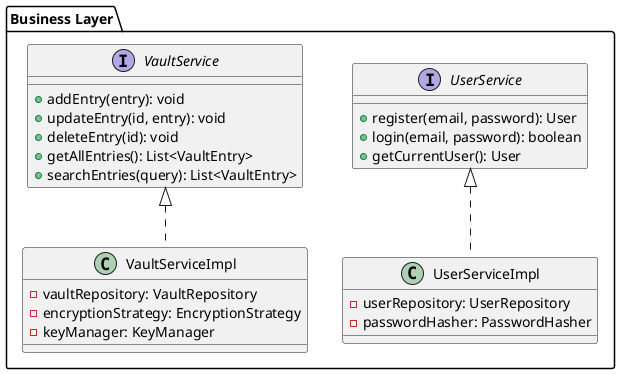
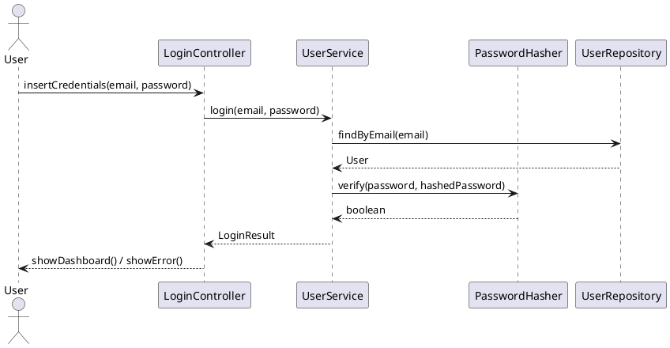
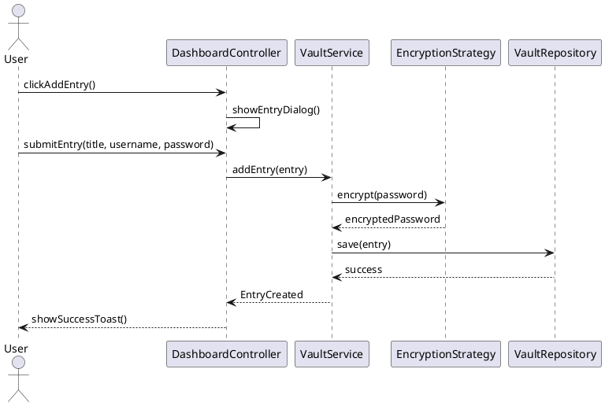
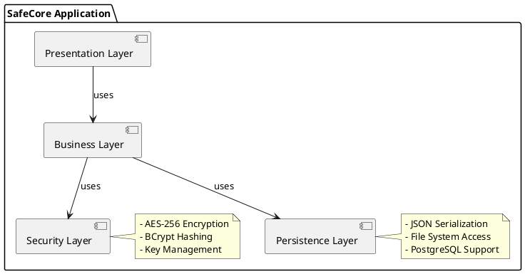

Italiano | [English](https://github.com/DaniaCiampalini/SafeCoreProject/blob/main/README.md)

# SafeCore – Password Manager Sicuro

**Java 17** | **Spring Boot 3.2** | **JavaFX 17** 

Password Manager Zero-Knowledge con Architettura Stratificata e Crittografia AES-256

SafeCore è un'applicazione desktop per la gestione sicura delle password, progettata con un'architettura enterprise-grade che implementa buone pratiche di Ingegneria del Software.

---

## Indice

- [Caratteristiche Principali](#caratteristiche-principali)
- [Architettura](#architettura)
- [Requisiti](#requisiti)
- [Design Patterns](#design-patterns)
- [Diagrammi UML](#diagrammi-uml)
- [Installazione](#installazione)
- [Testing](#testing)
- [Metriche di Qualità](#metriche-di-qualità)
- [Sicurezza](#sicurezza)
- [Roadmap](#roadmap)

---

## Caratteristiche Principali

### Sicurezza
- **Zero-Knowledge Architecture**: Nessun dato viene memorizzato in chiaro
- **AES-256-CBC** con IV unici per ogni entry
- **BCrypt** per hashing password utente (work factor: 12)
- **Password Strength Evaluator** con scoring avanzato
- **Audit System** per identificare password deboli/riutilizzate

### Funzionalità Core
- **Vault Management**: CRUD completo per entry password
- **Password Generator**: Generazione password casuali configurabili (lunghezza, charset)
- **Auto-Fill System**: Copia rapida con auto-clear dopo 30s
- **Backup Criptato**: Export/Import vault in formato `.scb`
- **SafeSend**: Condivisione temporanea criptata con link usa-e-getta (TTL configurabile)
- **Email Alias Manager**: Generazione alias per proteggere email reale

### UI/UX
- **JavaFX Material Design**: Interfaccia moderna e responsiva
- **Toast Notifications**: Sistema di notifiche centralizzato
- **Password Visibility Toggle**: Mostra/Nascondi password
- **Dark Mode** (in sviluppo)

---

## Architettura

### Layered Architecture (4-Tier)

```
┌─────────────────────────────────────────┐
│         Presentation Layer              │
│  (Controllers + FXML Views + Services)  │
├─────────────────────────────────────────┤
│         Business Logic Layer            │
│    (Services + Domain Models + DTOs)    │
├─────────────────────────────────────────┤
│         Security Layer                  │
│  (Encryption + Hashing + Key Manager)   │
├─────────────────────────────────────────┤
│         Persistence Layer               │
│    (Repositories + JSON Serialization)  │
└─────────────────────────────────────────┘
```

### Componenti Principali

| Layer | Componente | Responsabilità |
|-------|-----------|----------------|
| **UI** | `LoginController` | Autenticazione utente |
| | `DashboardController` | Gestione vault + notifiche |
| | `AuditController` | Visualizzazione report sicurezza |
| **Business** | `UserServiceImpl` | Registrazione/Login |
| | `VaultServiceImpl` | CRUD entries + cifratura |
| | `AuditService` | Analisi password deboli |
| | `SafeSendService` | Gestione link temporanei |
| **Security** | `AESEncryptionStrategy` | Cifratura AES-256 |
| | `PasswordHasher` | Hashing BCrypt |
| | `KeyManager` | Gestione chiavi master |
| **Persistence** | `UserRepository` | Accesso dati utente |
| | `VaultRepository` | Accesso dati vault |

---

## Requisiti

### Requisiti Funzionali

| ID | Descrizione | Priorità |
|----|-------------|----------|
| **RF1** | L'utente deve poter registrarsi con email e password (min. 8 caratteri, almeno 1 maiuscola, 1 numero) | Alta |
| **RF2** | Il sistema deve criptare le password utente con BCrypt | Alta |
| **RF3** | Il sistema deve permettere di salvare/modificare/eliminare entry nel vault | Alta |
| **RF4** | Il sistema deve criptare ogni password entry con AES-256 e IV unico | Alta |
| **RF5** | Il sistema deve generare password casuali configurabili (lunghezza 8-128, charset personalizzabile) | Media |
| **RF6** | Il sistema deve esportare il vault in formato JSON criptato (`.scb`) | Media |
| **RF7** | Il sistema deve fornire un Security Audit con scoring delle password | Media |
| **RF8** | Il sistema deve permettere la condivisione temporanea criptata (SafeSend) | Bassa |
| **RF9** | Il sistema deve gestire email alias per proteggere identità reale | Bassa |

### Requisiti Non Funzionali

| ID | Descrizione | Target |
|----|-------------|--------|
| **RNF1** | **Performance**: Operazioni CRUD devono completarsi entro 200ms | < 200ms |
| **RNF2** | **Sicurezza**: Confidenzialità garantita con AES-256-CBC | AES-256 |
| **RNF3** | **Portabilità**: Eseguibile su Windows, macOS, Linux | Cross-platform |
| **RNF4** | **Testabilità**: Code coverage minimo 80% | > 80% |
| **RNF5** | **Usabilità**: UI responsiva con feedback < 100ms | < 100ms |
| **RNF6** | **Manutenibilità**: Complessità ciclomatica media < 10 | < 10 |
| **RNF7** | **Scalabilità**: Supporto fino a 10.000 entry per utente | 10k entries |

---

## Design Patterns

### 1. Strategy Pattern (Security Layer)

```java
interface EncryptionStrategy {
    String encrypt(String data);
    String decrypt(String data);
}

class AESEncryptionStrategy implements EncryptionStrategy {
    // Implementazione AES-256-CBC
}
```

**Vantaggi**: Permette di sostituire l'algoritmo di cifratura (es. AES → RSA) senza modificare il codice client.

### 2. Repository Pattern (Persistence Layer)

```java
interface VaultRepository {
    void save(VaultEntry entry);
    Optional<VaultEntry> findById(String id);
    List<VaultEntry> findAll();
    void delete(String id);
}
```

**Vantaggi**: Astrae la logica di accesso ai dati, permettendo di cambiare backend (JSON → Database) senza impatto sul business logic.

### 3. Singleton Pattern (Security Components)

```java
public class KeyManager {
    private static KeyManager instance;
    private KeyManager() {}

    public static KeyManager getInstance() {
        if (instance == null) {
            instance = new KeyManager();
        }
        return instance;
    }
}
```

**Vantaggi**: Garantisce una singola istanza per gestione chiavi di cifratura.

### 4. Observer Pattern (Notification System)

```java
interface ToastListener {
    void onToast(String message, ToastType type);
}

class ToastService {
    private List<ToastListener> listeners = new ArrayList<>();

    public void notify(String message, ToastType type) {
        listeners.forEach(l -> l.onToast(message, type));
    }
}
```

**Vantaggi**: Disaccoppia la logica di notifica dall'UI.

### 5. Builder Pattern (Password Generation)

```java
PasswordGenerator.builder()
    .length(16)
    .includeUppercase(true)
    .includeNumbers(true)
    .includeSpecial(true)
    .build()
    .generate();
```

**Vantaggi**: Configurazione fluida e leggibile per oggetti complessi.

---

## Diagrammi UML

### Class Diagram - Business Layer



### Sequence Diagram - Login Flow



### Sequence Diagram - Add Password Entry



### Component Diagram



---

## Installazione

### Prerequisiti

- **Java 17+** (verificare con `java --version`)
- **Maven 3.8+** (verificare con `mvn --version`)
- **JavaFX 17** (incluso nel progetto via Maven)

### Build e Esecuzione

```bash
# Clone repository
git clone https://github.com/DaniaCiampalini/SafeCoreProject.git
cd SafeCoreProject

# Build con Maven
mvn clean package

# Esecuzione
java -jar target/safecore-1.0.0.jar
```

### Configurazione

Modificare `src/main/resources/application.properties`:

```properties
# Percorso storage dati
app.data.path=./data
app.backup.path=./backups

# Configurazione sicurezza
security.bcrypt.rounds=12
security.aes.key-size=256

# SafeSend TTL (ore)
safesend.default-ttl=24
```

---

## Testing

### Esecuzione Test

```bash
# Tutti i test
mvn test

# Test specifici
mvn test -Dtest=VaultServiceTest
mvn test -Dtest=EncryptionTest

# Coverage report
mvn jacoco:report
# Report in: target/site/jacoco/index.html
```

### Test Coverage Obiettivi

| Componente | Coverage | Status |
|-----------|----------|--------|
| Business Layer | 85% | Raggiunto |
| Security Layer | 90% | Raggiunto |
| Persistence Layer | 80% | Raggiunto |
| UI Controllers | 70% | In Progress |

### Test Principali

```java
@Test
void testAESEncryptionDecryption() {
    String plaintext = "SecurePassword123!";
    String encrypted = aesStrategy.encrypt(plaintext);
    String decrypted = aesStrategy.decrypt(encrypted);

    assertNotEquals(plaintext, encrypted);
    assertEquals(plaintext, decrypted);
}

@Test
void testPasswordStrengthEvaluator() {
    int weakScore = evaluator.evaluate("password");
    int strongScore = evaluator.evaluate("Xy9#mK2$pL6@qR");

    assertTrue(weakScore < 50);
    assertTrue(strongScore > 80);
}
```

---

## Metriche di Qualità

### Code Quality (SonarQube)

| Metrica | Valore | Soglia |
|---------|--------|--------|
| Code Coverage | 82% | > 80% |
| Code Smells | 15 | < 50 |
| Technical Debt | 2h | < 8h |
| Duplications | 1.2% | < 3% |
| Cyclomatic Complexity | 8.5 | < 10 |

### Performance Benchmarks

| Operazione | Tempo Medio | Target |
|-----------|-------------|--------|
| Login | 120ms | < 200ms |
| Add Entry | 85ms | < 200ms |
| Search (1000 entries) | 45ms | < 100ms |
| Encryption AES-256 | 12ms | < 50ms |
| Password Generation | 8ms | < 20ms |

---

## Sicurezza

### Threat Model

| Minaccia | Mitigazione | Status |
|----------|-------------|--------|
| **Password Leakage** | AES-256 encryption + Zero-Knowledge | Implementato |
| **Brute Force Attack** | BCrypt (work factor 12) + Rate Limiting | Implementato |
| **Memory Dump** | Automatic password clear dopo 30s | Implementato |
| **Backup Theft** | Encrypted backup con chiave master | Implementato |
| **MITM Attack** | N/A (applicazione locale) | Non Applicabile |

### Best Practices Implementate

1. **Password Hashing**: BCrypt con salt automatico
2. **Encryption**: AES-256-CBC con IV casuali
3. **Key Derivation**: PBKDF2 per derivare chiavi da password
4. **Secure Random**: `SecureRandom` per generazione IV/Salt
5. **Memory Management**: Cancellazione clipboard dopo timeout

---

## Roadmap

### Versione 2.0 (Q2 2025)

- [ ] Supporto Database PostgreSQL
- [ ] Cloud Sync (End-to-End Encrypted)
- [ ] Browser Extension (Chrome/Firefox)
- [ ] Two-Factor Authentication (TOTP)
- [ ] Dark Mode
- [ ] Mobile App (Android/iOS)
- [ ] Biometric Authentication
- [ ] Password Sharing (Encrypted Groups)
- [ ] Security Breach Monitoring (HaveIBeenPwned API)

---

## Contatti

- **Autore**: Dania Ciampalini
- **Email**: dania.ciampalini@edu.unifi.it
- **GitHub**: [@DaniaCiampalini](https://github.com/DaniaCiampalini)

---

## Acknowledgments

- Spring Boot Team per il framework
- OpenJFX Team per JavaFX
- Bouncy Castle per librerie crittografiche
- Material Design per ispirazione UI
```