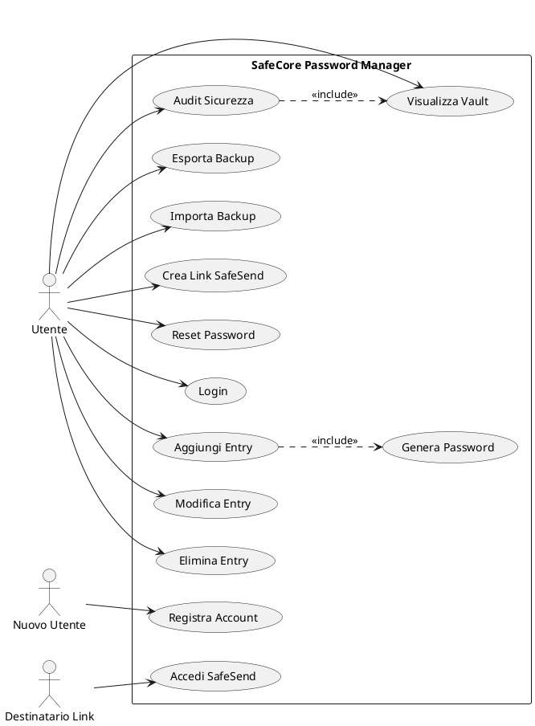
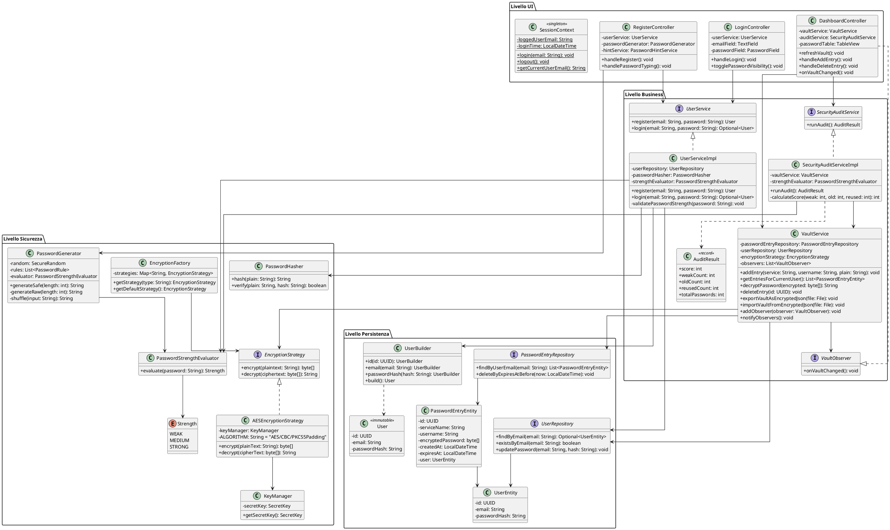
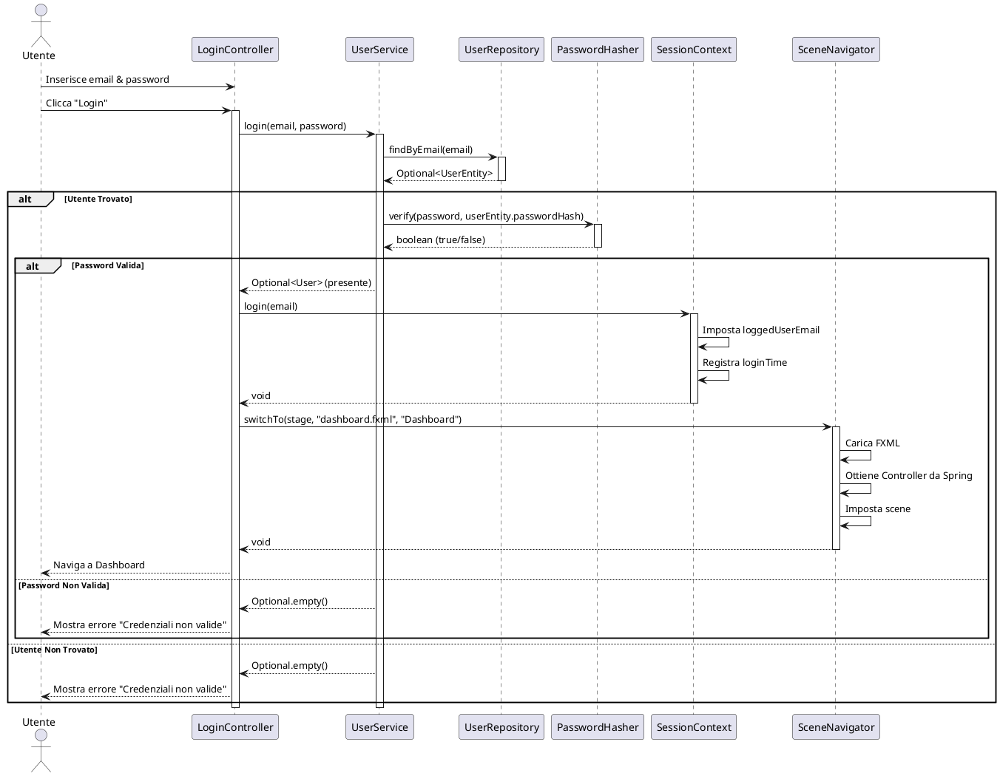
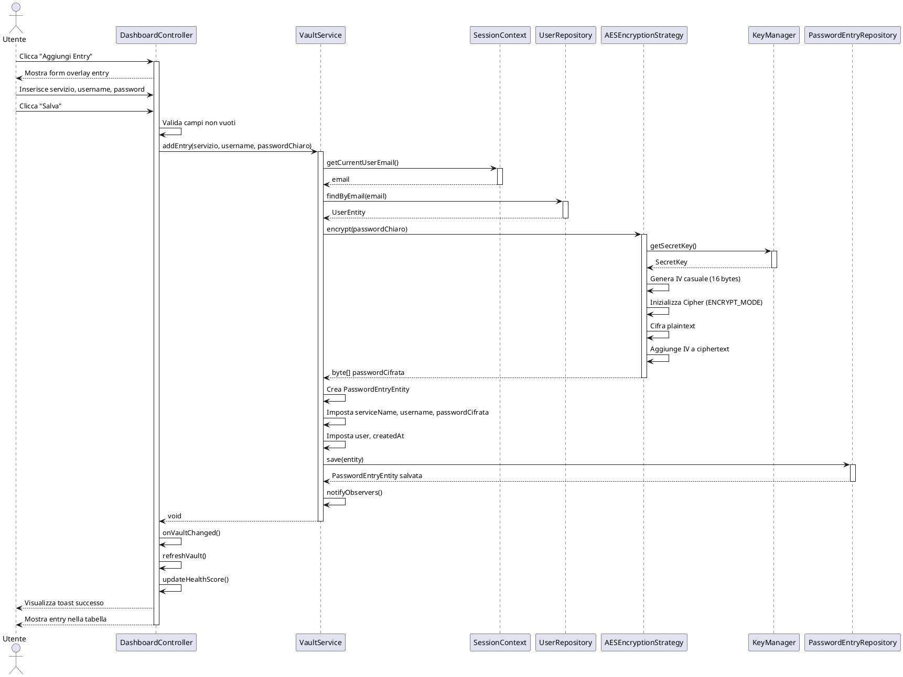
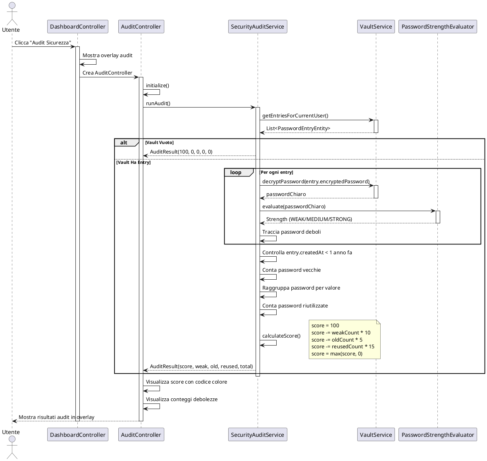
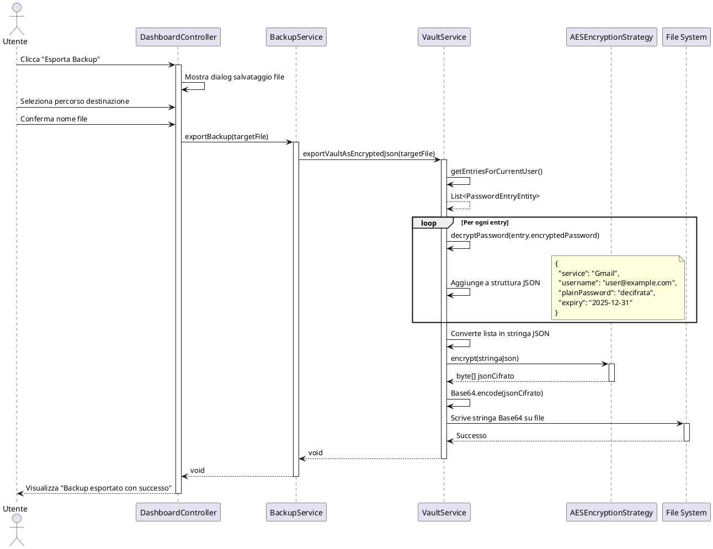
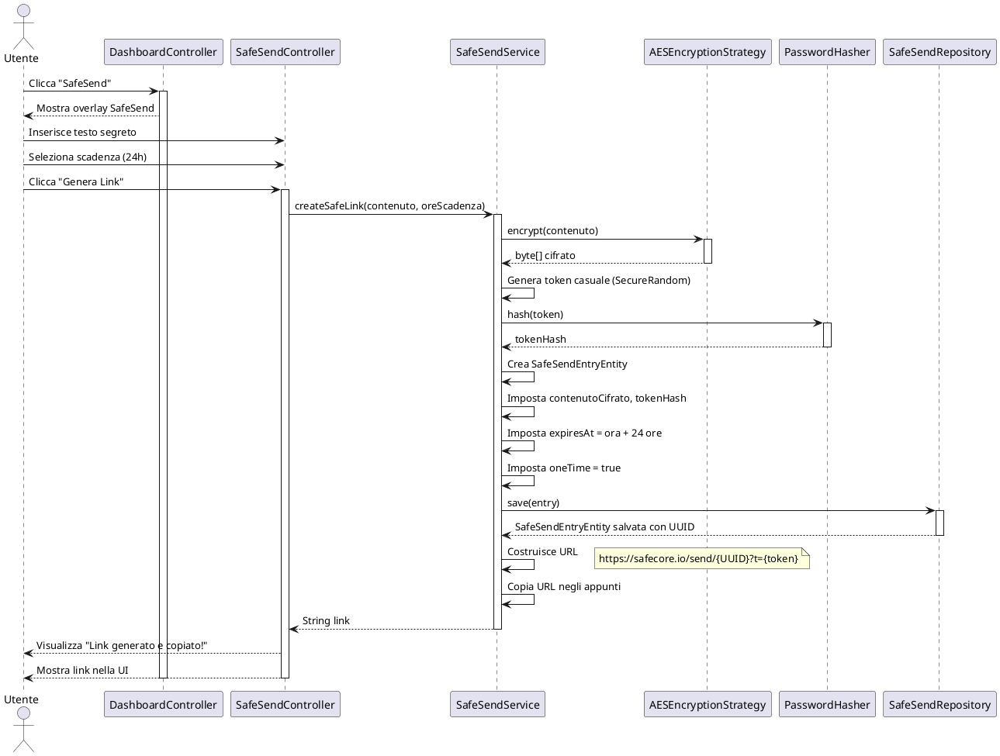
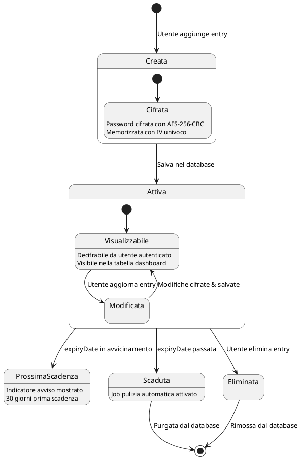
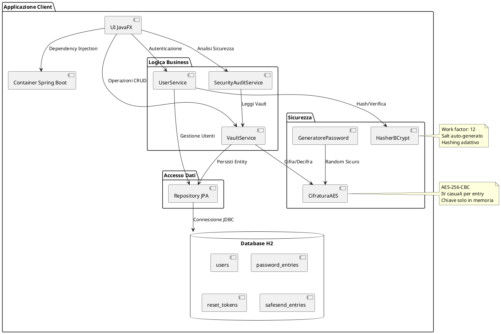

# README.it.md

# SafeCore - Gestore Password Sicuro

[Italiano] | [English](README.md)

Un gestore password desktop zero-knowledge costruito con architettura enterprise-grade, che implementa le migliori pratiche di Ingegneria del Software attraverso design stratificato, pattern di sicurezza e test completi.

## Indice

- [Panoramica](#panoramica)
- [Caratteristiche Principali](#caratteristiche-principali)
- [Architettura](#architettura)
- [Stack Tecnologico](#stack-tecnologico)
- [Struttura del Progetto](#struttura-del-progetto)
- [Design Patterns](#design-patterns)
- [Architettura di Sicurezza](#architettura-di-sicurezza)
- [Casi d'Uso](#casi-duso)
- [Diagrammi UML](#diagrammi-uml)
- [Installazione](#installazione)
- [Configurazione](#configurazione)
- [Utilizzo](#utilizzo)
- [Testing](#testing)
- [Documentazione API](#documentazione-api)
- [Contribuire](#contribuire)
- [Licenza](#licenza)
- [Ringraziamenti](#ringraziamenti)

## Panoramica

SafeCore è un'applicazione desktop per la gestione sicura delle password progettata con un'architettura stratificata che separa le responsabilità tra livelli UI, business logic, sicurezza e persistenza. L'applicazione implementa un'architettura zero-knowledge dove nessun dato sensibile viene memorizzato in chiaro, garantendo la massima sicurezza per le credenziali degli utenti.

Il progetto dimostra pratiche professionali di ingegneria del software tra cui:
- Architettura Pulita con chiara separazione delle responsabilità
- Design Patterns (Strategy, Repository, Builder, Observer, Singleton, Factory, Dependency Injection)
- Test unitari e di integrazione completi
- Design security-first con crittografia AES-256-CBC
- UI moderna JavaFX Material Design
- Dependency injection e gestione transazioni Spring Boot

## Caratteristiche Principali

### Funzionalità di Sicurezza

- **Architettura Zero-Knowledge**: Tutti i dati sensibili sono cifrati prima dell'archiviazione
- **Cifratura AES-256-CBC**: Crittografia standard del settore con vettori di inizializzazione univoci
- **Hashing Password BCrypt**: Password utente hashate con work factor 12
- **Valutazione Robustezza Password**: Analisi in tempo reale della robustezza con sistema di punteggio
- **Sistema di Audit di Sicurezza**: Analisi completa del vault identificando password deboli, vecchie e riutilizzate
- **Generatore Password Sicure**: Generazione password random crittograficamente sicura con complessità personalizzabile

### Funzionalità Core

- **Gestione Vault**: Operazioni CRUD complete per entry password con archiviazione cifrata
- **Autenticazione Utente**: Registrazione e login sicuri con validazione robustezza password
- **Scadenza Password**: Date di scadenza opzionali con pulizia automatica
- **Ricerca e Filtro**: Ricerca in tempo reale per nome servizio e username
- **Backup e Ripristino**: Export/import vault cifrato con formato file .safe
- **SafeSend**: Condivisione sicura di segreti monouso con scadenza temporale

### Esperienza Utente

- **UI Material Design Moderna**: Interfaccia JavaFX pulita e intuitiva
- **Gestione Sessione**: Sessione utente centralizzata con logout automatico
- **Toggle Visibilità Password**: Funzionalità mostra/nascondi password
- **Feedback in Tempo Reale**: Indicatori robustezza password e suggerimenti validazione
- **Dashboard Punteggio Salute**: Punteggio sicurezza visivo basato su risultati audit vault
- **Design Responsive**: Layout adattivo con dialog overlay e animazioni

## Architettura

### Architettura Stratificata (4-Tier)

```
┌─────────────────────────────────────────────────────────────┐
│                    LIVELLO PRESENTAZIONE                    │
│                      (JavaFX UI)                            │
│  - Controllers (Login, Dashboard, Register, Audit)          │
│  - Sistema Navigazione (SceneNavigator)                     │
│  - Gestione Sessione (SessionContext)                       │
│  - Gestore Eccezioni Globale                                │
└─────────────────────────────────────────────────────────────┘
                               ↓
┌─────────────────────────────────────────────────────────────┐
│                     LIVELLO BUSINESS                        │
│                   (Interfacce Service)                      │
│  - VaultService (gestione entry + cifratura)                │
│  - UserService (registrazione + autenticazione)             │
│  - SecurityAuditService (analisi vault)                     │
│  - SafeSendService (condivisione sicura)                    │
│  - BackupService (export/import)                            │
│  - PasswordHintService (validazione robustezza)             │
└─────────────────────────────────────────────────────────────┘
                               ↓
┌─────────────────────────────────────────────────────────────┐
│                     LIVELLO SICUREZZA                       │
│                  (Cifratura & Hashing)                      │
│  - EncryptionStrategy (interfaccia)                         │
│  - AESEncryptionStrategy (implementazione AES-256-CBC)      │
│  - PasswordHasher (BCrypt con salt)                         │
│  - PasswordGenerator (generazione random sicura)            │
│  - PasswordStrengthEvaluator (scoring robustezza)           │
│  - KeyManager (gestione chiavi cifratura)                   │
└─────────────────────────────────────────────────────────────┘
                               ↓
┌─────────────────────────────────────────────────────────────┐
│                   LIVELLO PERSISTENZA                       │
│                  (Repository JPA)                           │
│  - UserRepository (CRUD utenti)                             │
│  - PasswordEntryRepository (CRUD entry)                     │
│  - PasswordResetTokenRepository (gestione token)            │
│  - SafeSendRepository (archiviazione segreti temporanei)    │
│  - Database H2 (storage embedded basato su file)            │
└─────────────────────────────────────────────────────────────┘
```

### Responsabilità Componenti

| Livello | Componente | Responsabilità |
|---------|-----------|----------------|
| **UI** | `LoginController` | UI autenticazione utente e validazione form |
| | `RegisterController` | Registrazione utente con feedback robustezza password in tempo reale |
| | `DashboardController` | Gestione vault principale, CRUD entry, visualizzazione health score |
| | `AuditController` | Visualizzazione audit sicurezza e raccomandazioni |
| | `SceneNavigator` | Navigazione view centralizzata con injection contesto Spring |
| | `SessionContext` | Gestione sessione singleton con tracking stato utente |
| **Business** | `VaultService` | Cifratura/decifratura entry, operazioni CRUD, backup/ripristino |
| | `UserService` | Registrazione utente, validazione login, controllo robustezza password |
| | `SecurityAuditService` | Analisi vault, rilevamento debolezze, calcolo health score |
| | `SafeSendService` | Creazione segreti temporanei, gestione accesso monouso |
| **Sicurezza** | `AESEncryptionStrategy` | Cifratura AES-256-CBC con IV casuali |
| | `PasswordHasher` | Hashing BCrypt con work factor configurabile |
| | `PasswordGenerator` | Generazione password crittograficamente sicura |
| | `PasswordStrengthEvaluator` | Analisi robustezza password multi-fattore |
| **Persistenza** | `UserRepository` | Persistenza entity utente e operazioni query |
| | `PasswordEntryRepository` | Archiviazione entry password cifrate |
| | `PasswordEntryEntity` | Entity JPA con relazione Many-to-One verso User |
| | `UserEntity` | Entity JPA con vincolo email univoco |

## Stack Tecnologico

### Tecnologie Core

- **Java 17**: Versione LTS Java moderna con record, sealed classes e pattern matching avanzato
- **Spring Boot 3.2.2**: Framework enterprise per dependency injection, gestione transazioni e accesso dati
- **JavaFX 17**: Framework UI desktop moderno con layout dichiarativi FXML
- **Database H2**: Database embedded basato su file per storage locale

### Librerie Sicurezza

- **JBCrypt 0.4**: Implementazione hashing password BCrypt
- **Java Cryptography Extension (JCE)**: Supporto cifratura AES-256

### Framework Testing

- **JUnit 5**: Framework testing moderno con test parametrizzati e nested
- **Mockito**: Framework mocking per unit testing
- **Spring Boot Test**: Supporto integration testing con rollback transazioni
- **TestFX**: Framework testing UI JavaFX

### Strumenti Build

- **Maven**: Gestione progetto e risoluzione dipendenze
- **Spring Boot Maven Plugin**: Packaging JAR eseguibile

## Struttura del Progetto

```
SafeCoreProject/
├── src/
│   ├── main/
│   │   ├── java/com/safecore/
│   │   │   ├── SafeCoreApplication.java          # Entry point applicazione
│   │   │   ├── DatabaseDemoRunner.java           # Runner demo sviluppo
│   │   │   ├── business/                         # Livello business logic
│   │   │   │   ├── domain/                       # Modelli dominio (immutabili)
│   │   │   │   │   ├── User.java
│   │   │   │   │   ├── UserBuilder.java
│   │   │   │   │   ├── PasswordEntry.java
│   │   │   │   │   ├── UserFactory.java
│   │   │   │   │   └── AuditResult.java
│   │   │   │   ├── exception/                    # Eccezioni personalizzate
│   │   │   │   │   ├── SafeCoreException.java
│   │   │   │   │   ├── UserAlreadyExistsException.java
│   │   │   │   │   ├── UserNotFoundException.java
│   │   │   │   │   ├── WeakPasswordException.java
│   │   │   │   │   └── InvalidTokenException.java
│   │   │   │   ├── hints/                        # Regole validazione password
│   │   │   │   │   ├── HintLevel.java
│   │   │   │   │   ├── PasswordHint.java
│   │   │   │   │   └── rules/
│   │   │   │   │       ├── PasswordRule.java
│   │   │   │   │       ├── MinLengthRule.java
│   │   │   │   │       └── ComplexitycaseRule.java
│   │   │   │   └── service/                      # Interfacce service
│   │   │   │       ├── UserService.java
│   │   │   │       ├── VaultService.java
│   │   │   │       ├── SecurityAuditService.java
│   │   │   │       ├── SafeSendService.java
│   │   │   │       ├── BackupService.java
│   │   │   │       ├── PasswordService.java
│   │   │   │       ├── PasswordResetService.java
│   │   │   │       ├── PasswordHintService.java
│   │   │   │       ├── VaultObserver.java
│   │   │   │       ├── SessionLougoutObserver.java
│   │   │   │       ├── PasswordResetCompletedEvent.java
│   │   │   │       ├── PasswordResetEventPublisher.java
│   │   │   │       ├── PasswordResetObserver.java
│   │   │   │       ├── PasswordResetRequestResult.java
│   │   │   │       └── impl/                     # Implementazioni service
│   │   │   │           ├── UserServiceImpl.java
│   │   │   │           ├── PasswordServiceImpl.java
│   │   │   │           ├── SecurityAuditServiceImpl.java
│   │   │   │           ├── SafeSendServiceImpl.java
│   │   │   │           ├── BackupServiceImpl.java
│   │   │   │           └── PasswordResetServiceImpl.java
│   │   │   ├── persistence/                      # Livello accesso dati
│   │   │   │   ├── entity/                       # Entity JPA
│   │   │   │   │   ├── UserEntity.java
│   │   │   │   │   ├── PasswordEntryEntity.java
│   │   │   │   │   ├── PasswordResetTokenEntity.java
│   │   │   │   │   └── SafeSendEntryEntity.java
│   │   │   │   └── repository/                   # Repository Spring Data
│   │   │   │       ├── UserRepository.java
│   │   │   │       ├── PasswordEntryRepository.java
│   │   │   │       ├── PasswordResetTokenRepository.java
│   │   │   │       └── SafeSendRepository.java
│   │   │   ├── security/                         # Livello sicurezza
│   │   │   │   ├── EncryptionStrategy.java       # Interfaccia pattern Strategy
│   │   │   │   ├── AESEncryptionStrategy.java
│   │   │   │   ├── EncryptionFactory.java
│   │   │   │   ├── KeyManager.java
│   │   │   │   ├── PasswordHasher.java
│   │   │   │   ├── PasswordGenerator.java
│   │   │   │   └── PasswordStrengthEvaluator.java
│   │   │   └── ui/                               # Livello presentazione
│   │   │       ├── AppLauncher.java              # Launcher JavaFX
│   │   │       ├── GlobalExceptionHandler.java
│   │   │       ├── controller/                   # Controller UI
│   │   │       │   ├── LoginController.java
│   │   │       │   ├── RegisterController.java
│   │   │       │   ├── DashboardController.java
│   │   │       │   ├── AuditController.java
│   │   │       │   ├── SafeSendController.java
│   │   │       │   ├── AddEntryController.java
│   │   │       │   ├── PasswordResetController.java
│   │   │       │   └── BackupController.java
│   │   │       ├── navigation/
│   │   │       │   └── SceneNavigator.java
│   │   │       └── session/
│   │   │           └── SessionContext.java
│   │   └── resources/
│   │       ├── application.properties            # Configurazione Spring
│   │       ├── style.css
│   │       ├── add_entry.fxml
│   │       └── com/safecore/ui/view/            # View FXML
│   │           ├── login.fxml
│   │           ├── register.fxml
│   │           ├── dashboard.fxml
│   │           ├── audit-view.fxml
│   │           ├── reset-password.fxml
│   │           ├── safesend-view.fxml
│   │           └── password_reset.fxml
│   └── test/
│       ├── java/com/safecore/                   # Suite test
│       │   ├── SafeCoreIntegrationTest.java
│       │   ├── business/service/
│       │   │   ├── UserServiceTest.java
│       │   │   ├── PasswordServiceTest.java
│       │   │   ├── SecurityAuditServiceTest.java
│       │   │   ├── BackupIntegrationTest.java
│       │   │   ├── PasswordResetEventPublisherTest.java
│       │   │   ├── PasswordResetServiceTest.java
│       │   │   ├── SafeSendServiceTest.java
│       │   │   ├── SessionLogoutObserverTest.java
│       │   │   └── VaultServiceTest.java
│       │   ├── business/exception/
│       │   │   ├── UserNotFoundExceptionTest.java
│       │   │   ├── UserAlreadyExistsExceptionTest.java
│       │   │   ├── InvalidTokenExceptionTest.java
│       │   │   ├── SafeCoreExceptionTest.java
│       │   │   └── WeakPasswordExceptionTest.java
│       │   ├── business/hints/
│       │   │   └── PasswordHintServiceTest.java
│       │   ├── security/
│       │   │   ├── AESEncryptionStrategyTest.java
│       │   │   ├── AESEncryptionPerformanceTest.java
│       │   │   ├── PasswordGeneratorTest.java
│       │   │   ├── PasswordStrengthEvaluatorTest.java
│       │   │   ├── PasswordHasherTest.java
│       │   │   └── PasswordHasherPerformanceTest.java
│       │   └── persistence/repository/
│       │       ├── PasswordResetTokenRepositoryTest.java
│       │       ├── SafeSendRepositoryTest.java
│       │       └── UserRepositoryTest.java
│       └── resources
│           └── application-test.properties
├── docs/
│   └── uml/
│       ├── class-diagram.puml                   # Diagrammi PlantUML
│       ├── sequence-login.puml
│       ├── sequence-save-entry.puml
│       └── use-case.puml
├── pom.xml                                      # Configurazione Maven
├── README.md                                    # Documentazione inglese
└── README.it.md                                 # Questo file
```

## Design Patterns

### 1. Strategy Pattern (Cifratura)

Il pattern Strategy consente di cambiare algoritmo di cifratura senza modificare il codice client.

```java
public interface EncryptionStrategy {
    byte[] encrypt(String plaintext);
    String decrypt(byte[] ciphertext);
}

@Component
public class AESEncryptionStrategy implements EncryptionStrategy {
    private final KeyManager keyManager;
    
    @Override
    public byte[] encrypt(String plainText) {
        // Implementazione AES-256-CBC con IV casuale
        Cipher cipher = Cipher.getInstance("AES/CBC/PKCS5Padding");
        byte[] iv = new byte[16];
        new SecureRandom().nextBytes(iv);
        IvParameterSpec ivSpec = new IvParameterSpec(iv);
        cipher.init(Cipher.ENCRYPT_MODE, keyManager.getSecretKey(), ivSpec);
        byte[] encrypted = cipher.doFinal(plainText.getBytes(StandardCharsets.UTF_8));
        
        // Aggiunge IV al ciphertext per la decifratura
        byte[] result = new byte[iv.length + encrypted.length];
        System.arraycopy(iv, 0, result, 0, iv.length);
        System.arraycopy(encrypted, 0, result, iv.length, encrypted.length);
        return result;
    }
    
    @Override
    public String decrypt(byte[] cipherText) {
        // Estrae IV e decifra
        byte[] iv = new byte[16];
        byte[] encrypted = new byte[cipherText.length - 16];
        System.arraycopy(cipherText, 0, iv, 0, 16);
        System.arraycopy(cipherText, 16, encrypted, 0, encrypted.length);
        
        Cipher cipher = Cipher.getInstance("AES/CBC/PKCS5Padding");
        cipher.init(Cipher.DECRYPT_MODE, keyManager.getSecretKey(), new IvParameterSpec(iv));
        return new String(cipher.doFinal(encrypted), StandardCharsets.UTF_8);
    }
}
```

**Vantaggi**:
- Facile aggiungere nuovi algoritmi (RSA, ChaCha20, ecc.)
- Il codice client dipende dall'interfaccia, non dall'implementazione
- Logica di cifratura incapsulata e testabile in isolamento

### 2. Repository Pattern (Accesso Dati)

Il pattern Repository astrae la logica di accesso ai dati, permettendo cambiamenti al database senza impattare la business logic.

```java
@Repository
public interface PasswordEntryRepository extends JpaRepository<PasswordEntryEntity, UUID> {
    List<PasswordEntryEntity> findByUserEmail(String email);
    List<PasswordEntryEntity> findByUser(UserEntity user);
    void deleteByExpiresAtBefore(LocalDateTime now);
}
```

**Vantaggi**:
- L'implementazione database può cambiare senza toccare i service
- Logica query centralizzata con naming method Spring Data JPA
- Facile creare mock per unit testing
- Gestione transazioni integrata

### 3. Builder Pattern (Oggetti Dominio)

Il pattern Builder abilita costruzione fluida e leggibile di oggetti immutabili complessi.

```java
public final class PasswordEntry {
    private final UUID id;
    private final String serviceName;
    private final String username;
    private final byte[] encryptedPassword;
    private final LocalDateTime createdAt;

    private PasswordEntry(Builder builder) {
        this.id = builder.id;
        this.serviceName = builder.serviceName;
        this.username = builder.username;
        this.encryptedPassword = builder.encryptedPassword != null 
            ? builder.encryptedPassword.clone() : null;
        this.createdAt = builder.createdAt;
    }

    public static class Builder {
        private UUID id;
        private String serviceName;
        private String username;
        private byte[] encryptedPassword;
        private LocalDateTime createdAt;

        public Builder id(UUID id) { 
            this.id = id; 
            return this; 
        }
        
        public Builder serviceName(String sn) { 
            this.serviceName = sn; 
            return this; 
        }
        
        public Builder username(String un) { 
            this.username = un; 
            return this; 
        }
        
        public Builder encryptedPassword(byte[] ep) { 
            this.encryptedPassword = ep; 
            return this; 
        }
        
        public Builder createdAt(LocalDateTime ca) { 
            this.createdAt = ca; 
            return this; 
        }

        public PasswordEntry build() {
            Objects.requireNonNull(serviceName, "Nome servizio obbligatorio");
            Objects.requireNonNull(username, "Username obbligatorio");
            Objects.requireNonNull(encryptedPassword, "Password cifrata obbligatoria");
            if (createdAt == null) this.createdAt = LocalDateTime.now();
            return new PasswordEntry(this);
        }
    }
}

// Utilizzo
PasswordEntry entry = new PasswordEntry.Builder()
    .serviceName("Gmail")
    .username("user@example.com")
    .encryptedPassword(encryptedBytes)
    .createdAt(LocalDateTime.now())
    .build();
```

**Vantaggi**:
- Oggetti immutabili garantiscono thread safety
- API fluida migliora leggibilità codice
- Validazione compile-time dei campi obbligatori
- Combinazioni parametri flessibili

### 4. Observer Pattern (Aggiornamenti Vault)

Il pattern Observer abilita aggiornamenti reattivi della UI quando i dati del vault cambiano.

```java
public interface VaultObserver {
    void onVaultChanged();
}

@Service
public class VaultService {
    private final List<VaultObserver> observers = new ArrayList<>();

    public void addObserver(VaultObserver observer) { 
        observers.add(observer); 
    }
    
    public void notifyObservers() { 
        observers.forEach(VaultObserver::onVaultChanged); 
    }

    @Transactional
    public void addEntry(String service, String username, String plain) {
        // ... logica salvataggio entry ...
        notifyObservers(); // Notifica tutti gli osservatori
    }
}

@Component
public class DashboardController implements VaultObserver {
    @Override
    public void onVaultChanged() {
        refreshVault(); // Aggiorna tabella UI
        updateHealthScore(); // Ricalcola punteggio sicurezza
    }
}
```

**Vantaggi**:
- Comunicazione disaccoppiata tra service e UI
- Più osservatori possono reagire allo stesso evento
- Facile aggiungere nuovi osservatori senza modificare VaultService

### 5. Singleton Pattern (Gestione Sessione)

Il pattern Singleton garantisce un'unica istanza per la sessione utente applicativa.

```java
public final class SessionContext {
    private static volatile String loggedUserEmail;
    private static LocalDateTime loginTime;

    private SessionContext() {
        // Costruttore privato impedisce istanziazione
    }

    public static void login(String email) {
        if (email == null || email.isBlank()) {
            throw new IllegalArgumentException("Email sessione non valida");
        }
        loggedUserEmail = email;
        loginTime = LocalDateTime.now();
    }

    public static void logout() {
        loggedUserEmail = null;
        loginTime = null;
    }

    public static boolean isLoggedIn() {
        return loggedUserEmail != null;
    }

    public static String getCurrentUserEmail() {
        if (!isLoggedIn()) {
            throw new IllegalStateException("Nessun utente loggato");
        }
        return loggedUserEmail;
    }
}
```

**Vantaggi**:
- Punto di accesso globale per stato sessione
- Thread-safe con keyword volatile
- Previene istanze multiple di sessione

### 6. Factory Pattern (Selezione Strategia Cifratura)

Il pattern Factory centralizza la logica di creazione delle strategie di cifratura.

```java
@Component
public class EncryptionFactory {
    private final Map<String, EncryptionStrategy> strategies;

    public EncryptionFactory(List<EncryptionStrategy> strategyList) {
        this.strategies = strategyList.stream()
            .collect(Collectors.toMap(
                s -> s.getClass().getSimpleName()
                    .replace("EncryptionStrategy", "")
                    .toUpperCase(),
                Function.identity()
            ));
    }

    public EncryptionStrategy getStrategy(String type) {
        EncryptionStrategy strategy = strategies.get(type.toUpperCase());
        if (strategy == null) {
            throw new IllegalArgumentException("Cifratura non supportata: " + type);
        }
        return strategy;
    }

    public EncryptionStrategy getDefaultStrategy() {
        return getStrategy("AES");
    }
}
```

**Vantaggi**:
- Creazione e configurazione strategia centralizzata
- Facile aggiungere nuovi algoritmi via Spring
- Selezione strategia runtime basata su requisiti

### 7. Dependency Injection (Spring Framework)

Il container DI di Spring gestisce lifecycle e dipendenze degli oggetti.

```java
@Service
public class VaultService {
    private final PasswordEntryRepository repository;
    private final UserRepository userRepository;
    private final EncryptionStrategy encryptionStrategy;

    // Constructor injection (raccomandato)
    public VaultService(PasswordEntryRepository repository,
                       UserRepository userRepository,
                       EncryptionFactory encryptionFactory) {
        this.repository = repository;
        this.userRepository = userRepository;
        this.encryptionStrategy = encryptionFactory.getDefaultStrategy();
    }
}
```

**Vantaggi**:
- Accoppiamento lasco tra componenti
- Facile creare mock delle dipendenze per unit testing
- Configurazione e gestione lifecycle centralizzate
- Promuove programmazione basata su interfacce

## Architettura di Sicurezza

### Implementazione Cifratura

#### Cifratura AES-256-CBC

```
Password in Chiaro: "MySecretPass123!"
           ↓
    [Key Manager]
    SecureRandom genera chiave 256-bit
           ↓
    [Inizializzazione Cipher AES]
    Genera IV casuale 128-bit
    Modalità: CBC (Cipher Block Chaining)
    Padding: PKCS5
           ↓
    [Cifratura]
    Cifra plaintext usando chiave + IV
           ↓
    [Formato Storage]
    [IV (16 bytes)][Dati Cifrati (variabile)]
           ↓
    Memorizza in database come byte[]
```

**Proprietà Sicurezza**:
- Ogni password ha IV univoco (previene rilevamento pattern)
- Chiave 256-bit fornisce 2^256 chiavi possibili
- Modalità CBC garantisce che plaintext identici producano ciphertext diversi
- Chiave memorizzata solo in memoria, mai persistita

#### Hashing Password BCrypt

```
Password Utente: "MyMasterPass!"
           ↓
    [Algoritmo BCrypt]
    Work Factor: 12 (2^12 = 4096 iterazioni)
    Salt: Valore random 128-bit (auto-generato)
           ↓
    [Processo Hashing]
    Cifrario Blowfish + salt + iterazioni
           ↓
    [Risultato]
    $2a$12$[salt 22-char][hash 31-char]
           ↓
    Memorizza in UserEntity.passwordHash
```

**Proprietà Sicurezza**:
- Hashing adattivo (work factor aumenta con hardware)
- Salt univoco per password previene attacchi rainbow table
- Computazionalmente costoso (mitiga brute force)
- Algoritmo standard industria (raccomandato OWASP)

### Architettura Zero-Knowledge

SafeCore implementa vera sicurezza zero-knowledge:

1. **Master Password Mai Memorizzata**: Password utente hashate con BCrypt, valore originale mai persistito
2. **Entry Vault Cifrate**: Tutte le password cifrate con AES-256 prima dello storage database
3. **IV Univoci**: Ogni cifratura usa IV random fresco (no perdita pattern)
4. **Chiave in Memoria**: Chiave cifratura generata all'avvio, mai scritta su disco
5. **Decifratura Basata Sessione**: Password decifrate solo quando utente autenticato

### Valutazione Robustezza Password

Il sistema valuta la robustezza password usando criteri multipli:

```java
@Component
public class PasswordStrengthEvaluator {
    public Strength evaluate(String password) {
        if (password == null || password.length() < 6) return Strength.WEAK;

        boolean hasLower = password.matches(".*[a-z].*");
        boolean hasUpper = password.matches(".*[A-Z].*");
        boolean hasDigit = password.matches(".*\\d.*");
        boolean hasSymbol = password.matches(".*[^a-zA-Z0-9].*");

        int score = Stream.of(hasLower, hasUpper, hasDigit, hasSymbol)
            .mapToInt(b -> b ? 1 : 0)
            .sum();

        if (score <= 2 || password.length() < 8) return Strength.WEAK;
        if (score == 3) return Strength.MEDIUM;
        return Strength.STRONG;
    }

    public enum Strength { WEAK, MEDIUM, STRONG }
}
```

**Criteri**:
- Lunghezza: Minimo 8 caratteri (12+ raccomandato)
- Lettere minuscole: [a-z]
- Lettere maiuscole: [A-Z]
- Cifre: [0-9]
- Caratteri speciali: [!@#$%^&*()-_=+[]{}<>]

**Punteggio**:
- WEAK: 0-2 criteri soddisfatti OPPURE < 8 caratteri
- MEDIUM: 3 criteri soddisfatti
- STRONG: Tutti e 4 i criteri soddisfatti

### Sistema Audit Sicurezza

Il servizio audit analizza la sicurezza del vault e calcola l'health score:

```java
@Service
public class SecurityAuditServiceImpl implements SecurityAuditService {
    @Override
    public AuditResult runAudit() {
        List<PasswordEntryEntity> entries = vaultService.getEntriesForCurrentUser();
        
        // Decifra tutte le password per analisi
        List<String> decryptedPasswords = entries.stream()
            .map(e -> vaultService.decryptPassword(e.getEncryptedPassword()))
            .toList();

        // Analizza debolezze
        int weakCount = countWeakPasswords(decryptedPasswords);
        int oldCount = countOldPasswords(entries);
        int reusedCount = countReusedPasswords(decryptedPasswords);

        // Calcola health score
        int score = 100 - (weakCount * 10) - (oldCount * 5) - (reusedCount * 15);
        
        return new AuditResult(Math.max(score, 0), weakCount, oldCount, reusedCount, entries.size());
    }
}
```

**Criteri Audit**:
- **Password Deboli**: -10 punti ciascuna (password che non soddisfano requisiti robustezza)
- **Password Vecchie**: -5 punti ciascuna (password più vecchie di 1 anno)
- **Password Riutilizzate**: -15 punti per riutilizzo (stessa password usata più volte)

**Range Health Score**:
- 80-100: Eccellente (indicatore verde)
- 50-79: Buono (indicatore giallo)
- 0-49: Scarso (indicatore rosso)

## Casi d'Uso

### UC-1: Registrazione Utente

**Attore Primario**: Nuovo Utente

**Precondizioni**:
- Applicazione avviata
- Utente non autenticato

**Scenario di Successo Principale**:
1. Utente clicca "Registrati" sulla schermata login
2. Sistema visualizza form registrazione
3. Utente inserisce indirizzo email
4. Utente inserisce master password
5. Sistema valida robustezza password in tempo reale
6. Utente conferma master password
7. Sistema valida:
    - Formato email è valido
    - Email non già registrata
    - Password coincidono
    - Password soddisfa robustezza minima (MEDIUM o STRONG)
8. Sistema hasha password con BCrypt
9. Sistema crea UserEntity con password hashata
10. Sistema salva utente nel database
11. Sistema visualizza messaggio successo
12. Sistema reindirizza a schermata login

**Flussi Alternativi**:
- 5a. Password è WEAK:
    1. Sistema visualizza indicatore robustezza in rosso
    2. Sistema mostra suggerimenti specifici debolezza
    3. Utente modifica password
    4. Torna al passo 5

- 7a. Email già registrata:
    1. Sistema visualizza errore "Account esiste"
    2. Sistema suggerisce login invece
    3. Caso d'uso termina

- 7b. Password non coincidono:
    1. Sistema evidenzia errore mancata corrispondenza
    2. Utente corregge password
    3. Torna al passo 7

**Postcondizioni**:
- Nuovo account utente creato con credenziali cifrate
- Utente può effettuare login con email e master password

---

### UC-2: Login Utente

**Attore Primario**: Utente Registrato

**Precondizioni**:
- Utente ha account registrato
- Utente non attualmente autenticato

**Scenario di Successo Principale**:
1. Utente inserisce indirizzo email
2. Utente inserisce master password
3. Utente clicca pulsante "Login"
4. Sistema recupera UserEntity per email
5. Sistema verifica password usando BCrypt
6. Sistema inizializza SessionContext con email utente
7. Sistema registra timestamp login
8. Sistema reindirizza a Dashboard
9. Sistema carica entry vault cifrate dell'utente
10. Sistema visualizza tabella vault con dati decifrati

**Flussi Alternativi**:
- 4a. Email non trovata:
    1. Sistema visualizza errore "Credenziali non valide"
    2. Sistema non rivela se email o password errata (sicurezza)
    3. Caso d'uso termina

- 5a. Verifica password fallisce:
    1. Sistema visualizza errore "Credenziali non valide"
    2. Caso d'uso termina

**Postcondizioni**:
- Utente autenticato con sessione attiva
- Dashboard caricata con dati vault utente
- Punteggio audit sicurezza calcolato e visualizzato

---

### UC-3: Aggiungere Entry Password

**Attore Primario**: Utente Autenticato

**Precondizioni**:
- Utente loggato
- Dashboard visualizzata

**Scenario di Successo Principale**:
1. Utente clicca pulsante "Aggiungi Entry"
2. Sistema visualizza overlay form entry
3. Utente inserisce:
    - Nome servizio (es. "Gmail")
    - Username/email
    - Password (manuale o generata)
    - Opzionale: Data scadenza
4. Sistema valida tutti i campi non vuoti
5. Sistema cifra password usando AES-256-CBC
6. Sistema genera IV random 128-bit
7. Sistema crea PasswordEntryEntity
8. Sistema associa entry con utente corrente
9. Sistema salva entry nel database
10. Sistema notifica VaultObserver
11. Sistema aggiorna tabella dashboard
12. Sistema aggiorna health score
13. Sistema visualizza notifica successo

**Flussi Alternativi**:
- 3a. Utente clicca "Genera Password":
    1. Sistema mostra form generatore password
    2. Utente seleziona lunghezza (12-32 caratteri)
    3. Sistema genera password random crittograficamente sicura
    4. Sistema valida password generata soddisfa criteri STRONG
    5. Sistema visualizza password generata nel form
    6. Utente può copiare negli appunti o rigenerare
    7. Torna al passo 3

- 4a. Campo obbligatorio vuoto:
    1. Sistema evidenzia campo vuoto
    2. Sistema impedisce invio form
    3. Torna al passo 3

**Postcondizioni**:
- Nuova entry cifrata memorizzata nel database
- Entry visibile nella tabella dashboard
- Health score ricalcolato
- Entry decifrabile solo da utente autenticato

---

### UC-4: Audit Sicurezza

**Attore Primario**: Utente Autenticato

**Precondizioni**:
- Utente loggato
- Utente ha almeno una entry vault

**Scenario di Successo Principale**:
1. Utente clicca pulsante "Audit Sicurezza"
2. Sistema recupera tutte le entry dell'utente
3. Sistema decifra tutte le password per analisi
4. Sistema valuta robustezza di ogni password
5. Sistema identifica password deboli (< STRONG)
6. Sistema identifica password vecchie (> 1 anno)
7. Sistema identifica password riutilizzate (duplicati)
8. Sistema calcola health score:
    - Base: 100 punti
    - Deduce 10 punti per password debole
    - Deduce 5 punti per password vecchia
    - Deduce 15 punti per password riutilizzata
9. Sistema visualizza risultati audit:
    - Health score complessivo
    - Conteggio password deboli
    - Conteggio password vecchie
    - Conteggio password riutilizzate
10. Sistema colora punteggio (verde/giallo/rosso)
11. Sistema fornisce raccomandazioni

**Flussi Alternativi**:
- 2a. Vault è vuoto:
    1. Sistema visualizza "Nessuna entry da analizzare"
    2. Sistema mostra punteggio perfetto 100/100
    3. Caso d'uso termina

**Postcondizioni**:
- Utente consapevole dello stato sicurezza vault
- Vulnerabilità specifiche identificate
- Raccomandazioni fornite per miglioramento

---

### UC-5: Generare Password Sicura

**Attore Primario**: Utente Autenticato

**Precondizioni**:
- Utente loggato
- Form Aggiungi Entry visualizzato

**Scenario di Successo Principale**:
1. Utente clicca pulsante "Genera"
2. Sistema mostra interfaccia generatore password
3. Utente imposta parametri:
    - Lunghezza: 12-32 caratteri (default 16)
4. Sistema genera password:
    - Almeno una lettera minuscola
    - Almeno una lettera maiuscola
    - Almeno una cifra
    - Almeno un carattere speciale
    - Caratteri rimanenti selezionati casualmente
5. Sistema mescola caratteri usando algoritmo Fisher-Yates
6. Sistema valida password generata è STRONG
7. Sistema visualizza password generata
8. Utente clicca "Copia negli Appunti"
9. Sistema copia password negli appunti di sistema
10. Sistema mostra conferma "Copiato!"
11. Sistema pulisce appunti dopo 60 secondi (sicurezza)

**Flussi Alternativi**:
- 6a. Password generata non STRONG:
    1. Sistema rigenera password
    2. Torna al passo 4

- 8a. Utente clicca "Rigenera":
    1. Torna al passo 4

**Postcondizioni**:
- Password forte generata e disponibile per uso
- Password soddisfa tutti i criteri sicurezza
- Utente può incollare nel form entry

---

### UC-6: Esportare Backup Vault

**Attore Primario**: Utente Autenticato

**Precondizioni**:
- Utente loggato
- Utente ha almeno una entry vault

**Scenario di Successo Principale**:
1. Utente clicca pulsante "Esporta Backup"
2. Sistema mostra dialog salvataggio file
3. Sistema suggerisce nome file: `safecore_backup_YYYY-MM-DD.safe`
4. Utente seleziona cartella destinazione
5. Utente conferma nome file
6. Sistema recupera tutte le entry dell'utente
7. Sistema decifra tutte le password
8. Sistema crea struttura JSON:
   ```json
   [
     {
       "service": "Gmail",
       "username": "user@example.com",
       "plainPassword": "password_decifrata",
       "expiry": "2025-12-31T23:59:59"
     }
   ]
   ```
9. Sistema cifra JSON con AES-256-CBC
10. Sistema codifica ciphertext in Base64
11. Sistema scrive stringa Base64 in file .safe
12. Sistema visualizza notifica successo

**Flussi Alternativi**:
- 6a. Vault è vuoto:
    1. Sistema visualizza errore "Niente da esportare"
    2. Caso d'uso termina

- 11a. Scrittura file fallisce (permessi/disco pieno):
    1. Sistema visualizza messaggio errore
    2. Sistema suggerisce posizione alternativa
    3. Torna al passo 2

**Postcondizioni**:
- File backup cifrato creato
- Backup può essere importato su stesso o diverso dispositivo
- Backup richiede stessa chiave cifratura

---

### UC-7: Importare Backup Vault

**Attore Primario**: Utente Autenticato

**Precondizioni**:
- Utente loggato
- Utente ha file backup .safe valido

**Scenario di Successo Principale**:
1. Utente clicca pulsante "Importa Backup"
2. Sistema mostra dialog apertura file
3. Utente seleziona file backup .safe
4. Utente clicca "Apri"
5. Sistema legge contenuti file
6. Sistema decodifica Base64 a ciphertext
7. Sistema decifra ciphertext usando AES-256-CBC
8. Sistema analizza struttura JSON
9. Sistema valida formato JSON
10. Per ogni entry nel backup:
    - Decifra password in chiaro dal backup
    - Ri-cifra con chiave utente corrente
    - Crea PasswordEntryEntity
    - Associa con utente corrente
    - Salva nel database
11. Sistema notifica VaultObserver
12. Sistema aggiorna dashboard
13. Sistema visualizza conteggio import: "X entry importate"

**Flussi Alternativi**:
- 7a. Decifratura fallisce (chiave errata):
    1. Sistema visualizza errore "Backup corrotto o incompatibile"
    2. Sistema suggerisce verifica integrità file
    3. Caso d'uso termina

- 9a. Parsing JSON fallisce:
    1. Sistema visualizza errore "Formato backup non valido"
    2. Caso d'uso termina

- 10a. Entry duplicata rilevata (stesso servizio + username):
    1. Sistema salta duplicato
    2. Continua alla entry successiva

**Postcondizioni**:
- Entry backup importate e cifrate
- Tutte le entry visibili in dashboard
- Health score ricalcolato

---

### UC-8: SafeSend Condivisione Sicura

**Attore Primario**: Utente Autenticato

**Precondizioni**:
- Utente loggato
- Utente vuole condividere informazioni segrete

**Scenario di Successo Principale**:
1. Utente clicca pulsante "SafeSend"
2. Sistema visualizza overlay SafeSend
3. Utente inserisce testo segreto (password, chiave API, ecc.)
4. Utente seleziona tempo scadenza:
    - 1 ora
    - 12 ore
    - 24 ore (default)
    - 7 giorni
5. Utente clicca "Genera Link"
6. Sistema cifra segreto con AES-256-CBC
7. Sistema genera token random crittograficamente sicuro
8. Sistema hasha token con BCrypt
9. Sistema crea SafeSendEntryEntity:
    - Contenuto cifrato
    - Hash token
    - Timestamp scadenza
    - Flag monouso: true
10. Sistema salva entry nel database
11. Sistema genera URL condivisibile:
    ```
    https://safecore.io/send/{UUID}?t={token}
    ```
12. Sistema copia URL negli appunti
13. Sistema visualizza: "Link generato e copiato!"
14. Utente condivide link via canale sicuro

**Flussi Alternativi**:
- 3a. Testo segreto vuoto:
    1. Sistema disabilita pulsante "Genera Link"
    2. Torna al passo 3

**Postcondizioni**:
- Segreto cifrato e memorizzato con scadenza
- Link univoco generato per accesso monouso
- Link auto-scade dopo tempo o primo accesso

---

### UC-9: SafeSend Accesso Segreto

**Attore Primario**: Destinatario Link (può essere non autenticato)

**Precondizioni**:
- Destinatario ha link SafeSend valido
- Link non ancora acceduto (monouso)
- Link non scaduto

**Scenario di Successo Principale**:
1. Destinatario clicca link SafeSend
2. Sistema analizza URL per estrarre:
    - UUID entry
    - Token accesso
3. Sistema recupera SafeSendEntryEntity per UUID
4. Sistema valida entry esiste
5. Sistema controlla timestamp scadenza
6. Sistema verifica token contro hash memorizzato
7. Sistema decifra contenuto segreto
8. Sistema visualizza segreto al destinatario
9. Sistema elimina immediatamente entry dal database
10. Sistema visualizza "Questo segreto è stato distrutto"

**Flussi Alternativi**:
- 4a. Entry non trovata (già acceduta):
    1. Sistema visualizza "Link scaduto o già usato"
    2. Caso d'uso termina

- 5a. Link scaduto:
    1. Sistema elimina entry
    2. Sistema visualizza "Link è scaduto"
    3. Caso d'uso termina

- 6a. Verifica token fallisce:
    1. Sistema visualizza "Link non valido o manomesso"
    2. Sistema registra evento sicurezza
    3. Caso d'uso termina

**Postcondizioni**:
- Segreto acceduto e visualizzato una volta
- Entry permanentemente eliminata dal database
- Link non più funzionale

---

### UC-10: Richiesta Reset Password

**Attore Primario**: Utente Registrato (password dimenticata)

**Precondizioni**:
- Utente ha account registrato
- Utente non ricorda master password

**Scenario di Successo Principale**:
1. Utente clicca "Password Dimenticata?" su schermata login
2. Sistema visualizza form reset password
3. Utente inserisce indirizzo email registrato
4. Utente clicca "Richiedi Reset"
5. Sistema valida email esiste nel database
6. Sistema genera token random crittograficamente sicuro
7. Sistema hasha token con BCrypt
8. Sistema crea PasswordResetTokenEntity:
    - Email utente
    - Hash token
    - Scadenza: 15 minuti
    - Flag usato: false
9. Sistema salva token nel database
10. Sistema visualizza token all'utente (email simulata)
11. Utente copia token
12. Utente inserisce:
    - Email
    - Token reset
    - Nuova master password
    - Conferma password
13. Sistema valida token:
    - Hash token corrisponde
    - Non scaduto (< 15 minuti)
    - Non già usato
14. Sistema valida robustezza nuova password (MEDIUM o STRONG)
15. Sistema hasha nuova password con BCrypt
16. Sistema aggiorna UserEntity.passwordHash
17. Sistema marca token come usato
18. Sistema visualizza messaggio successo
19. Sistema reindirizza a schermata login

**Flussi Alternativi**:
- 5a. Email non trovata:
    1. Sistema visualizza messaggio generico "Se account esiste, token inviato"
    2. Sistema non rivela esistenza email (sicurezza)
    3. Caso d'uso termina

- 13a. Token non valido/scaduto:
    1. Sistema visualizza "Token reset non valido o scaduto"
    2. Sistema suggerisce richiedere nuovo token
    3. Caso d'uso termina

- 14a. Nuova password troppo debole:
    1. Sistema visualizza errore robustezza
    2. Sistema mostra suggerimenti miglioramento
    3. Torna al passo 12

**Postcondizioni**:
- Master password utente aggiornata
- Vecchio hash password sostituito
- Token reset invalidato
- Utente può effettuare login con nuova password

**Nota Importante**: Tutte le entry vault cifrate rimangono cifrate con vecchia chiave. In produzione, richiederebbe ri-cifratura con nuova chiave derivata da nuova password.

## Diagrammi UML

### Diagramma Casi d'Uso



### Diagramma Classi - Architettura Sistema Completa



### Diagramma Sequenza - Flusso Login Utente



### Diagramma Sequenza - Aggiungere Entry Password



### Diagramma Sequenza - Audit Sicurezza



### Diagramma Sequenza - Esportare Backup Vault



### Diagramma Sequenza - SafeSend Crea Link



### Diagramma Stati - Ciclo Vita Entry Password



### Diagramma Componenti - Architettura Sistema



## Installazione

### Prerequisiti

- **Java 17 o superiore**: Scarica da [AdoptOpenJDK](https://adoptium.net/)
- **Maven 3.8+**: Scarica da [Sito Ufficiale Maven](https://maven.apache.org/download.cgi)
- **Git**: Per clonare il repository

### Passo 1: Clonare Repository

```bash
git clone https://github.com/DaniaCiampalini/SafeCoreProject.git
cd SafeCoreProject
```

### Passo 2: Build Progetto

```bash
mvn clean install
```

Questo eseguirà:
- Download di tutte le dipendenze
- Compilazione codice sorgente
- Esecuzione test unitari e di integrazione
- Packaging applicazione come JAR eseguibile

### Passo 3: Eseguire Applicazione

```bash
mvn spring-boot:run
```

Oppure esegui il JAR direttamente:

```bash
java -jar target/SafeCore-1.0-SNAPSHOT.jar
```

### Passo 4: Verifica Installazione

1. La finestra applicazione dovrebbe aprirsi con schermata login
2. Clicca "Registrati" per creare primo account utente
3. Inserisci email e password sicura (minimo robustezza MEDIUM)
4. Effettua login con credenziali create
5. La dashboard dovrebbe visualizzarsi con vault vuoto

## Configurazione

### Configurazione Database

Modifica `src/main/resources/application.properties`:

```properties
# Database H2 (basato su file, persistente)
spring.datasource.url=jdbc:h2:file:./safecore_db;AUTO_SERVER=TRUE
spring.datasource.driver-class-name=org.h2.Driver
spring.datasource.username=sa
spring.datasource.password=

# JPA/Hibernate
spring.jpa.hibernate.ddl-auto=update
spring.jpa.show-sql=true
spring.jpa.properties.hibernate.format_sql=true
spring.jpa.database-platform=org.hibernate.dialect.H2Dialect

# Console H2 (solo sviluppo)
spring.h2.console.enabled=true
spring.h2.console.path=/h2-console
spring.h2.console.settings.web-allow-others=true
```

**Posizione Database**: `./safecore_db.mv.db` (file nella root progetto)

### Configurazione Sicurezza

Work factor BCrypt (in `PasswordHasher.java`):

```java
public String hash(String plain) {
    return BCrypt.hashpw(plain, BCrypt.gensalt(12)); // Regola work factor qui
}
```

**Raccomandazioni**:
- Sviluppo: Work factor 10-12 (più veloce)
- Produzione: Work factor 12-14 (più sicuro, più lento)

### Configurazione UI JavaFX

Posizione view FXML: `src/main/resources/com/safecore/ui/view/`

Per personalizzare UI:
1. Apri file FXML in Scene Builder o editor testo
2. Modifica layout, colori, etichette
3. Ricompila progetto: `mvn clean package`

## Utilizzo

### Setup Primo Avvio

1. **Avvia Applicazione**
   ```bash
   mvn spring-boot:run
   ```

2. **Crea Account**
    - Clicca "Registrati" sulla schermata login
    - Inserisci indirizzo email valido
    - Crea master password forte (MEDIUM o STRONG)
    - Conferma password corrisponde
    - Clicca "Registrati"

3. **Login**
    - Inserisci email registrata
    - Inserisci master password
    - Clicca "Login"

### Gestire Password

#### Aggiungere Nuova Entry

1. Clicca pulsante "Aggiungi Entry" sulla dashboard
2. Compila form:
    - Nome Servizio (es. "Gmail", "GitHub")
    - Username/Email
    - Password (manuale o generata)
    - Opzionale: Data scadenza
3. Clicca "Salva"

#### Generare Password Sicura

1. Clicca pulsante "Genera" nel form aggiungi entry
2. Regola slider lunghezza (12-32 caratteri)
3. Clicca "Genera" per creare password
4. Clicca "Copia" per copiare negli appunti
5. Incolla nel campo password

#### Cercare nel Vault

- Digita nella barra ricerca in alto
- La tabella filtra in tempo reale per nome servizio o username

#### Visualizzare/Copiare Password

- Clicca icona "occhio" per rivelare password
- Clicca icona "copia" per copiare negli appunti
- Gli appunti si puliscono automaticamente dopo 60 secondi

#### Eliminare Entry

- Clicca icona "elimina" (cestino)
- Conferma eliminazione nel dialog

### Audit Sicurezza

1. Clicca pulsante "Audit Sicurezza"
2. Il sistema analizza tutte le entry vault:
    - Password deboli (sotto criteri STRONG)
    - Password vecchie (> 1 anno)
    - Password riutilizzate (duplicati)
3. Visualizza health score (0-100):
    - 80-100: Eccellente (verde)
    - 50-79: Buono (giallo)
    - 0-49: Scarso (rosso)
4. Rivedi raccomandazioni per migliorare score

### Backup & Ripristino

#### Esportare Backup

1. Clicca "Backup" → "Esporta"
2. Scegli cartella destinazione
3. Conferma nome file (es. `safecore_backup_2025-01-30.safe`)
4. File backup cifrato con tua chiave

#### Importare Backup

1. Clicca "Backup" → "Importa"
2. Seleziona file backup `.safe`
3. Il sistema decifra e importa entry
4. La dashboard si aggiorna con dati importati

**Importante**: I backup sono cifrati con la tua chiave di cifratura corrente. Mantieni la chiave sicura!

### SafeSend (Condivisione Sicura)

#### Creare Link Condivisibile

1. Clicca pulsante "SafeSend"
2. Incolla testo segreto (password, chiave API, nota)
3. Seleziona tempo scadenza:
    - 1 ora
    - 12 ore
    - 24 ore (raccomandato)
    - 7 giorni
4. Clicca "Genera Link"
5. Link copiato automaticamente negli appunti
6. Condividi link via canale sicuro (Signal, email cifrata)

#### Accedere Segreto Condiviso

1. Il destinatario clicca sul link
2. Il segreto viene visualizzato una volta
3. Entry si autodistrugge immediatamente
4. Link diventa non valido

**Note Sicurezza**:
- I link sono monouso
- I segreti sono cifrati con AES-256
- Auto-scadono dopo tempo specificato
- Accesso registrato (funzionalità futura)

## Testing

### Eseguire Tutti i Test

```bash
mvn test
```

### Copertura Test

- **Test Unitari**: 45+ test che coprono business logic, sicurezza e accesso dati
- **Test Integrazione**: Test workflow completi con database H2 in-memory
- **Test Performance**: Validazione performance hashing BCrypt

### Categorie Test

#### Test Unitari (Dipendenze Mock)

```bash
# Esegui classe test specifica
mvn test -Dtest=UserServiceTest

# Esegui metodo test specifico
mvn test -Dtest=UserServiceTest#registerAndLogin_success
```

**Esempi**:
- `UserServiceTest`: Validazione registrazione e login
- `PasswordHasherTest`: Correttezza hashing BCrypt
- `AESEncryptionStrategyTest`: Cicli cifratura/decifratura
- `SecurityAuditServiceTest`: Calcolo health score

#### Test Integrazione (Database Reale)

```bash
mvn test -Dtest=SafeCoreIntegrationTest
```

Testa workflow utente completo:
1. Registrazione utente
2. Autenticazione login
3. Aggiunta entry cifrata
4. Recupero e decifratura entry
5. Gestione sessione

#### Test Performance

```bash
mvn test -Dtest=PasswordHasherPerformanceTest
```

Valida:
- Hashing BCrypt completato entro 1000ms
- Verifica password sotto 500ms
- Performance consistente tra iterazioni

### Configurazione Test

Application.properties specifico per test in `src/test/resources/application-test.properties`:

```properties
# Database H2 in-memory per test
spring.datasource.url=jdbc:h2:mem:testdb
spring.jpa.hibernate.ddl-auto=create-drop
spring.jpa.show-sql=false
```

### Scrivere Nuovi Test

#### Template Test Unitario

```java
@SpringBootTest
class MioServiceTest {
    
    @Autowired
    private MioService mioService;
    
    @MockBean
    private MioRepository mioRepository;
    
    @Test
    void testNomeMetodo_quandoCondizione_alloraRisultatoAtteso() {
        // Arrange
        when(mioRepository.findById(1L)).thenReturn(Optional.of(entity));
        
        // Act
        Risultato risultato = mioService.eseguiOperazione(1L);
        
        // Assert
        assertNotNull(risultato);
        assertEquals(valoreAtteso, risultato.getValore());
        verify(mioRepository, times(1)).findById(1L);
    }
}
```

## Documentazione API

### API Service Interne

#### UserService

```java
public interface UserService {
    /**
     * Registra nuovo utente con email e password.
     * 
     * @param email Email utente (deve essere univoca)
     * @param plainPassword Master password (minimo robustezza MEDIUM)
     * @return Oggetto dominio User immutabile
     * @throws UserAlreadyExistsException se email già registrata
     * @throws WeakPasswordException se password sotto robustezza minima
     */
    User register(String email, String plainPassword);
    
    /**
     * Autentica utente con credenziali.
     * 
     * @param email Email registrata
     * @param plainPassword Password testo in chiaro
     * @return Optional<User> - presente se credenziali valide, vuoto altrimenti
     */
    Optional<User> login(String email, String plainPassword);
}
```

#### VaultService

```java
public class VaultService {
    /**
     * Aggiunge entry password cifrata per utente corrente.
     * 
     * @param service Nome servizio (es. "Gmail")
     * @param username Username o email per servizio
     * @param plain Password testo in chiaro (verrà cifrata)
     * @param expiry Data scadenza opzionale (null per nessuna scadenza)
     */
    @Transactional
    public void addEntry(String service, String username, String plain, LocalDateTime expiry);
    
    /**
     * Recupera tutte le entry password per utente attualmente autenticato.
     * 
     * @return Lista di PasswordEntryEntity con password cifrate
     */
    public List<PasswordEntryEntity> getEntriesForCurrentUser();
    
    /**
     * Decifra password da array byte cifrato.
     * 
     * @param encrypted Byte password cifrata (include IV)
     * @return Password testo in chiaro decifrata
     */
    public String decryptPassword(byte[] encrypted);
    
    /**
     * Elimina entry password per ID.
     * 
     * @param id UUID entry
     */
    @Transactional
    public void deleteEntry(UUID id);
    
    /**
     * Esporta intero vault come backup JSON cifrato.
     * 
     * @param destinationFile File .safe destinazione
     * @throws Exception se cifratura o scrittura file fallisce
     */
    @Transactional(readOnly = true)
    public void exportVaultAsEncryptedJson(File destinationFile) throws Exception;
    
    /**
     * Importa entry vault da backup cifrato.
     * 
     * @param sourceFile File .safe sorgente
     * @throws Exception se decifratura o parsing fallisce
     */
    @Transactional
    public void importVaultFromEncryptedJson(File sourceFile) throws Exception;
}
```

#### SecurityAuditService

```java
public interface SecurityAuditService {
    /**
     * Analizza vault per debolezze sicurezza.
     * 
     * @return AuditResult con health score e conteggi vulnerabilità
     */
    AuditResult runAudit();
}

public record AuditResult(
    int score,           // Health score 0-100
    int weakCount,       // Numero password deboli
    int oldCount,        // Numero password > 1 anno
    int reusedCount,     // Numero password riutilizzate
    int totalPasswords   // Totale entry vault
) {}
```

#### PasswordGenerator

```java
@Component
public class PasswordGenerator {
    /**
     * Genera password crittograficamente sicura.
     * 
     * @param length Lunghezza desiderata (minimo 12, raccomandato 16+)
     * @return Password casuale che soddisfa criteri STRONG
     */
    public String generateSafe(int length);
}
```

#### PasswordStrengthEvaluator

```java
@Component
public class PasswordStrengthEvaluator {
    /**
     * Valuta robustezza password basata su criteri multipli.
     * 
     * @param password Password da valutare
     * @return Enum Strength (WEAK, MEDIUM, STRONG)
     */
    public Strength evaluate(String password);
    
    public enum Strength {
        WEAK,    // < 8 char OPPURE < 3 criteri
        MEDIUM,  // >= 8 char E 3 criteri
        STRONG   // >= 8 char E tutti 4 criteri
    }
}
```

### API Cifratura

#### EncryptionStrategy

```java
public interface EncryptionStrategy {
    /**
     * Cifra stringa plaintext in array byte.
     * 
     * @param plaintext Dati da cifrare
     * @return Byte cifrati con IV anteposto
     */
    byte[] encrypt(String plaintext);
    
    /**
     * Decifra array byte in stringa plaintext.
     * 
     * @param ciphertext Byte cifrati (include IV)
     * @return Plaintext decifrato
     * @throws SecurityException se decifratura fallisce
     */
    String decrypt(byte[] ciphertext);
}
```

#### AESEncryptionStrategy

```java
@Component
public class AESEncryptionStrategy implements EncryptionStrategy {
    private static final String ALGORITHM = "AES/CBC/PKCS5Padding";
    
    @Override
    public byte[] encrypt(String plainText) {
        // 1. Genera IV casuale 128-bit
        // 2. Inizializza Cipher con AES-256-CBC
        // 3. Cifra plaintext
        // 4. Antepone IV a ciphertext
        // 5. Ritorna array byte combinato
    }
    
    @Override
    public String decrypt(byte[] cipherText) {
        // 1. Estrae primi 16 byte come IV
        // 2. Estrae byte rimanenti come ciphertext
        // 3. Inizializza Cipher con IV
        // 4. Decifra ciphertext
        // 5. Ritorna stringa plaintext
    }
}
```

## Contribuire

I contributi sono benvenuti! Segui queste linee guida:

### Setup Sviluppo

1. Fai fork del repository
2. Crea branch feature:
   ```bash
   git checkout -b feature/nome-tua-feature
   ```
3. Effettua modifiche con commit chiari e atomici
4. Scrivi/aggiorna test per nuove funzionalità
5. Assicurati che tutti i test passino:
   ```bash
   mvn test
   ```
6. Verifica qualità codice:
   ```bash
   mvn checkstyle:check
   ```

### Stile Codice

- **Java**: Segui Oracle Java Code Conventions
- **Indentazione**: 4 spazi (no tab)
- **Lunghezza Riga**: Max 120 caratteri
- **Naming**:
    - Classi: PascalCase
    - Metodi/Variabili: camelCase
    - Costanti: UPPER_SNAKE_CASE
- **JavaDoc**: Obbligatorio per API pubbliche

### Messaggi Commit

Formato: `tipo(ambito): descrizione`

**Tipi**:
- `feat`: Nuova funzionalità
- `fix`: Correzione bug
- `docs`: Solo documentazione
- `style`: Stile codice (formattazione, nessuna modifica logica)
- `refactor`: Ristrutturazione codice
- `test`: Aggiunta/aggiornamento test
- `chore`: Processo build, dipendenze

**Esempio**:
```
feat(vault): Aggiunge scadenza automatica entry password

- Implementa job pulizia schedulato
- Aggiunge colonna expiresAt a PasswordEntryEntity
- Aggiorna UI per visualizzare avvisi scadenza
```

### Processo Pull Request

1. Aggiorna README.md con modifiche (se applicabile)
2. Aggiorna CHANGELOG.md con nuova versione
3. Assicurati che tutti i test passino e copertura mantenuta
4. Richiedi revisione dai maintainer
5. Affronta feedback revisione
6. Squasha commit se richiesto
7. I maintainer effettuano merge dopo approvazione

### Segnalare Bug

Usa GitHub Issues con template:

```markdown
**Descrivi il bug**
Descrizione chiara di cosa non funziona.

**Come Riprodurre**
1. Vai a '...'
2. Clicca su '....'
3. Vedi errore

**Comportamento Atteso**
Cosa avrebbe dovuto succedere.

**Screenshot**
Se applicabile.

**Ambiente:**
- OS: [es. Windows 11, macOS Ventura]
- Versione Java: [es. OpenJDK 17.0.5]
- Versione SafeCore: [es. 1.0.0]

**Contesto Aggiuntivo**
Qualsiasi altra informazione rilevante.
```

### Suggerire Funzionalità

Usa GitHub Issues con template:

```markdown
**Descrizione Funzionalità**
Descrizione chiara della funzionalità proposta.

**Caso d'Uso**
Perché questa funzionalità è necessaria?

**Soluzione Proposta**
Come dovrebbe funzionare?

**Alternative Considerate**
Altri approcci a cui hai pensato.

**Contesto Aggiuntivo**
Mockup, diagrammi, issue correlate.
```

## Licenza

Questo progetto è rilasciato sotto **Licenza MIT**.

```
Licenza MIT

Copyright (c) 2024 Dania Ciampalini

È concesso il permesso, gratuitamente, a chiunque ottenga una copia
di questo software e dei file di documentazione associati (il "Software"),
di trattare il Software senza restrizioni, inclusi senza limitazione i diritti
di utilizzare, copiare, modificare, unire, pubblicare, distribuire, concedere in
sublicenza e/o vendere copie del Software, e di consentire alle persone a cui il
Software è fornito di fare ciò, alle seguenti condizioni:

L'avviso di copyright sopra indicato e questo avviso di permesso devono essere
inclusi in tutte le copie o porzioni sostanziali del Software.

IL SOFTWARE È FORNITO "COSÌ COM'È", SENZA GARANZIA DI ALCUN TIPO, ESPRESSA O
IMPLICITA, INCLUSE MA NON LIMITATE A GARANZIE DI COMMERCIABILITÀ, IDONEITÀ
PER UN PARTICOLARE SCOPO E NON VIOLAZIONE. IN NESSUN CASO GLI AUTORI O I
DETENTORI DEL COPYRIGHT SARANNO RESPONSABILI PER QUALSIASI RECLAMO, DANNO O
ALTRA RESPONSABILITÀ, SIA IN UN'AZIONE CONTRATTUALE, ILLECITO O ALTRO, DERIVANTE
DA, FUORI O IN CONNESSIONE CON IL SOFTWARE O L'USO O ALTRE OPERAZIONI NEL SOFTWARE.
```

## Ringraziamenti

Questo progetto è stato costruito utilizzando eccezionali tecnologie open-source:

- **Team Spring Framework**: Per Spring Boot 3.x, Spring Data JPA e dependency injection completa
- **Community OpenJFX**: Per JavaFX 17 e capacità UI desktop moderne
- **Team Database H2**: Per database embedded leggero e veloce
- **Contributori jBCrypt**: Per implementazione BCrypt robusta
- **Team JUnit**: Per framework testing JUnit 5
- **Contributori Mockito**: Per potenti capacità di mocking
- **Progetto PlantUML**: Per generazione diagrammi UML
- **Community Maven**: Per build affidabile e gestione dipendenze

### Ringraziamenti Speciali

- **OWASP**: Per best practice sicurezza e linee guida storage password
- **Material Design**: Per ispirazione design UI/UX
- **GitHub**: Per hosting e strumenti collaborazione

### Risorse Educative

- *Effective Java* di Joshua Bloch
- *Design Patterns: Elements of Reusable Object-Oriented Software* del Gang of Four
- *Spring in Action* di Craig Walls

---

**SafeCore** - Sicurezza Password Enterprise-Grade

Costruito con sicurezza, qualità ed eccellenza ingegneristica.

Per supporto, apri un'issue su [GitHub](https://github.com/DaniaCiampalini/SafeCoreProject/issues).

Autore: **Dania Ciampalini**

Email: dania.ciampalini@edu.unifi.it

GitHub: [@DaniaCiampalini](https://github.com/DaniaCiampalini)
```

