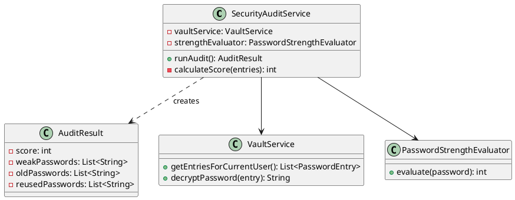
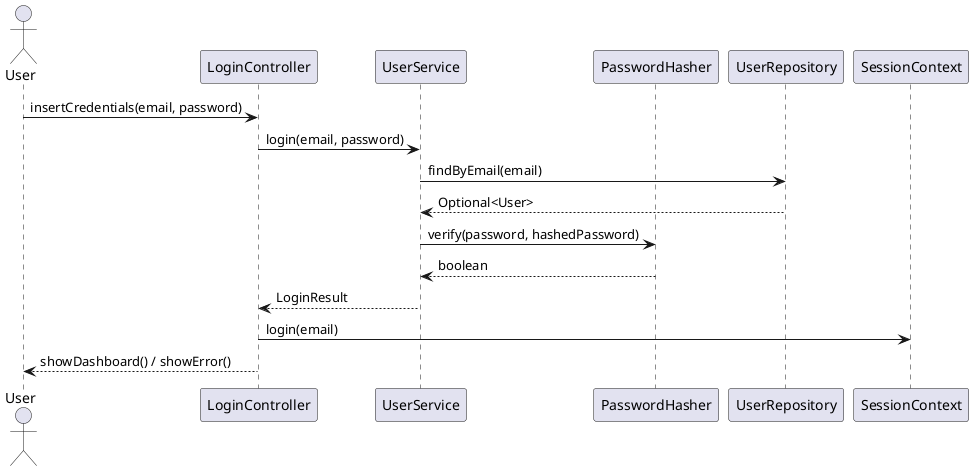
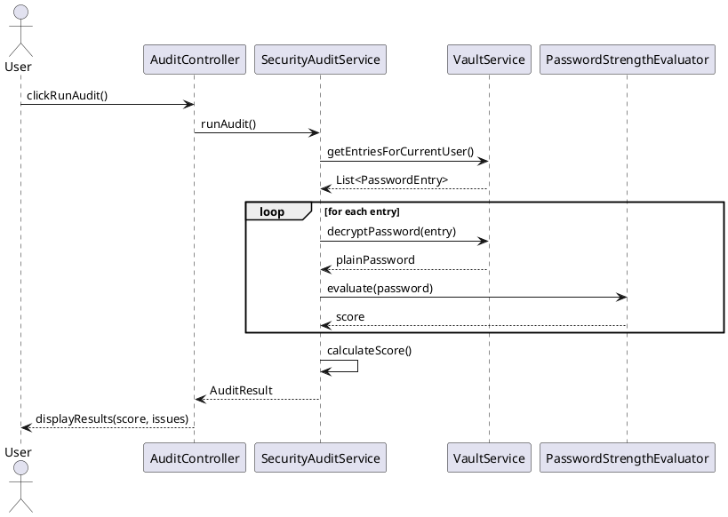

# SafeCore – Secure Password Manager

English | [Italiano](https://github.com/DaniaCiampalini/SafeCoreProject/blob/main/README.it.md)

**Java 17** | **Spring Boot 3.2** | **JavaFX 17** | **H2 Database**

Zero-Knowledge Password Manager with Layered Architecture and AES-256 Encryption

SafeCore is a desktop application for secure password management, designed with an enterprise-grade architecture that implements Software Engineering best practices.

---

## Table of Contents

- [Key Features](#key-features)
- [Architecture](#architecture)
- [Requirements](#requirements)
- [Design Patterns](#design-patterns)
- [UML Diagrams](#uml-diagrams)
- [Installation](#installation)
- [Testing](#testing)
- [Quality Metrics](#quality-metrics)
- [Security](#security)
- [Roadmap](#roadmap)
- [Contacts](#contacts)

---

## Key Features

### Security
- **Zero-Knowledge Architecture**: No data stored in plain text
- **AES-256-CBC** with unique IVs for each entry
- **BCrypt** for user password hashing (work factor: 12)
- **Password Strength Evaluator** with advanced scoring
- **Audit System** to identify weak/reused/old passwords

### Core Functionality
- **Vault Management**: Complete CRUD for password entries
- **Password Generator**: Configurable random password generation (length, charset)
- **Security Audit**: Scoring system 0-100
- **H2 Database**: Local persistence with JPA/Hibernate

### UI/UX
- **JavaFX Material Design**: Modern and responsive interface
- **Session Management**: Centralized user session handling
- **Password Visibility Toggle**: Show/Hide passwords
- **Navigation System**: Smooth navigation between views

---

## Architecture

### Layered Architecture (4-Tier)

```
┌─────────────────────────────────────────┐
│         UI Layer (JavaFX)               │
│  - Controllers (Login, Dashboard, etc.) │
│  - Navigation System                    │
│  - Session Manager                      │
├─────────────────────────────────────────┤
│         Business Layer                  │
│  - VaultService                         │
│  - SecurityAuditService                 │
│  - UserService                          │
├─────────────────────────────────────────┤
│         Security Layer                  │
│  - AESEncryptionStrategy                │
│  - PasswordHasher (BCrypt)              │
│  - PasswordGenerator                    │
│  - PasswordStrengthEvaluator            │
├─────────────────────────────────────────┤
│         Persistence Layer               │
│  - JPA Repositories                     │
│  - H2 Database                          │
│  - Entity Models                        │
└─────────────────────────────────────────┘
```

### Main Components

| Layer | Component | Responsibility |
|-------|-----------|----------------|
| **UI** | `LoginController` | User authentication |
| | `DashboardController` | Main vault management |
| | `AuditController` | Security report visualization |
| | `NavigationManager` | View navigation management |
| | `SessionContext` | User session management |
| **Business** | `VaultService` | CRUD entries + encryption/decryption |
| | `SecurityAuditService` | Password analysis and scoring |
| | `UserService` | User registration/login |
| **Security** | `AESEncryptionStrategy` | AES-256-CBC encryption |
| | `PasswordHasher` | BCrypt hashing |
| | `PasswordGenerator` | Secure password generation |
| | `PasswordStrengthEvaluator` | Strength evaluation (0-100) |
| **Persistence** | `PasswordEntryRepository` | Spring Data JPA repository |
| | `UserRepository` | User repository |
| | `PasswordEntryEntity` | JPA entity for passwords |

---

## Requirements

### Functional Requirements

| ID | Description | Priority |
|----|-------------|----------|
| **FR1** | Users must be able to register with email and password (min. 8 chars) | High |
| **FR2** | System must encrypt user passwords with BCrypt | High |
| **FR3** | System must allow saving/modifying/deleting vault entries | High |
| **FR4** | System must encrypt each password entry with AES-256 and unique IV | High |
| **FR5** | System must generate configurable random passwords (length 8-128) | Medium |
| **FR6** | System must provide Security Audit with 0-100 scoring | Medium |
| **FR7** | System must identify weak passwords (score < 50) | Medium |
| **FR8** | System must identify old passwords (> 1 year) | Medium |
| **FR9** | System must identify reused passwords | Medium |

### Non-Functional Requirements

| ID | Description | Target |
|----|-------------|--------|
| **NFR1** | **Performance**: CRUD operations must complete within 200ms | < 200ms |
| **NFR2** | **Security**: Confidentiality guaranteed with AES-256-CBC | AES-256 |
| **NFR3** | **Portability**: Executable on Windows, macOS, Linux | Cross-platform |
| **NFR4** | **Testability**: Minimum code coverage 80% | > 80% |
| **NFR5** | **Maintainability**: Unit tests with Mockito for isolation | Implemented |
| **NFR6** | **Scalability**: Support up to 10,000 entries per user | 10k entries |

---

## Design Patterns

### 1. Strategy Pattern (Security Layer)

**Implementation**:

```java
public interface EncryptionStrategy {
    String encrypt(String data);
    String decrypt(String data);
}

@Component
public class AESEncryptionStrategy implements EncryptionStrategy {
    // AES-256-CBC implementation with random IVs
}
```

**Benefits**: Allows switching encryption algorithms without modifying client code.

---

### 2. Repository Pattern (Persistence Layer)

**Implementation**:

```java
public interface PasswordEntryRepository extends JpaRepository<PasswordEntryEntity, Long> {
    List<PasswordEntryEntity> findByUserEmail(String email);
}
```

**Benefits**: Abstracts data access logic, allowing backend changes without impacting business logic.

---

### 3. Singleton Pattern (Session Management)

**Implementation**:

```java
public class SessionContext {
    private static SessionContext instance;
    private String currentUserEmail;

    public static SessionContext getInstance() {
        if (instance == null) {
            instance = new SessionContext();
        }
        return instance;
    }
}
```

**Benefits**: Ensures a single instance for user session management.

---

### 4. Dependency Injection (Spring)

**Implementation**:

```java
@Service
public class VaultService {
    private final PasswordEntryRepository repository;
    private final EncryptionStrategy encryptionStrategy;

    @Autowired
    public VaultService(PasswordEntryRepository repository, 
                       EncryptionStrategy encryptionStrategy) {
        this.repository = repository;
        this.encryptionStrategy = encryptionStrategy;
    }
}
```

**Benefits**: Reduces coupling and facilitates testing with mocks.

---

### 5. Builder Pattern (Password Generation)

**Implementation**:

```java
PasswordGenerator generator = PasswordGenerator.builder()
    .length(16)
    .includeUppercase(true)
    .includeNumbers(true)
    .includeSpecial(true)
    .build();
    
String password = generator.generate();
```

**Benefits**: Fluent and readable configuration for complex objects.

---

## UML Diagrams

### Class Diagram - Security Audit Service



---

### Sequence Diagram - Login Flow



---

### Sequence Diagram - Security Audit



---

## Installation

### Prerequisites

- **Java 17+** (verify with `java --version`)
- **Maven 3.8+** (verify with `mvn --version`)
- **JavaFX 17** (included in project via Maven)

### Build and Execution

```bash
# Clone repository
git clone https://github.com/DaniaCiampalini/SafeCoreProject.git
cd SafeCoreProject

# Build with Maven
mvn clean package

# Execution
java -jar target/safecore-1.0.0.jar
```

### Database Configuration

The project uses **H2 in file mode** for local persistence.

File: `src/main/resources/application.properties`

```properties
# H2 Database Configuration
spring.datasource.url=jdbc:h2:file:./safecore_db
spring.datasource.driverClassName=org.h2.Driver
spring.datasource.username=sa
spring.datasource.password=

# JPA Configuration
spring.jpa.hibernate.ddl-auto=update
spring.jpa.show-sql=false
spring.jpa.properties.hibernate.format_sql=true

# H2 Console (disabled in production)
spring.h2.console.enabled=false
```

---

## Testing

### Testing Strategy

The project implements two types of tests:

1. **Unit Tests with Mockito**: Test isolated components by mocking dependencies
2. **Integration Tests**: Test complete end-to-end flow

---

### Test Execution

```bash
# All tests
mvn test

# Specific tests
mvn test -Dtest=SecurityAuditServiceTest
mvn test -Dtest=VaultServiceTest

# Coverage report (JaCoCo)
mvn jacoco:report
# Report available in: target/site/jacoco/index.html
```

---

### Unit Tests with Mockito

**Example**: `SecurityAuditServiceTest.java`

```java
@ExtendWith(MockitoExtension.class)
class SecurityAuditServiceTest {

    @Mock
    private VaultService vaultService;

    @Mock
    private PasswordStrengthEvaluator strengthEvaluator;

    @InjectMocks
    private SecurityAuditService auditService;

    @Test
    void testAuditWithWeakPasswords() {
        // ARRANGE: Setup mock behavior
        when(vaultService.getEntriesForCurrentUser())
            .thenReturn(List.of(
                createEntry("weak123", 30, false),
                createEntry("Strong!Pass123", 90, false)
            ));

        when(strengthEvaluator.evaluate("weak123")).thenReturn(30);
        when(strengthEvaluator.evaluate("Strong!Pass123")).thenReturn(90);

        // ACT: Run audit
        AuditResult result = auditService.runAudit();

        // ASSERT: Verify results
        assertEquals(90, result.getScore()); // 100 - 10 (weak password)
        assertEquals(1, result.getWeakPasswords().size());
        
        // VERIFY: Check mock interactions
        verify(vaultService).getEntriesForCurrentUser();
        verify(strengthEvaluator, times(2)).evaluate(anyString());
    }
}
```

**Benefits of Mocks**:
- ✅ Very fast tests (milliseconds)
- ✅ Complete component isolation
- ✅ Full control over test data
- ✅ Ability to test edge cases

---

### Integration Tests

**Example**: `SafeCoreIntegrationTest.java`

```java
@SpringBootTest
@Transactional
class SafeCoreIntegrationTest {

    @Autowired
    private UserService userService;

    @Autowired
    private VaultService vaultService;

    @Test
    void testCompleteUserFlow() {
        // Registration
        userService.register("test@example.com", "SecurePass123!");
        
        // Login
        Optional<User> user = userService.login("test@example.com", "SecurePass123!");
        assertTrue(user.isPresent());
        
        // Session management
        SessionContext.getInstance().login("test@example.com");
        
        // Add password
        vaultService.addEntry("GitHub", "username", "MyPassword123!");
        
        // Verify decryption
        List<PasswordEntry> entries = vaultService.getEntriesForCurrentUser();
        assertEquals(1, entries.size());
        
        String decrypted = vaultService.decryptPassword(entries.get(0));
        assertEquals("MyPassword123!", decrypted);
    }
}
```

**Benefits of Integration Tests**:
- ✅ Verifies real integration between components
- ✅ Uses H2 in-memory database
- ✅ Tests end-to-end flow
- ✅ Reveals Spring/JPA configuration issues

---

### Test Coverage Targets

| Component | Coverage Target | Status |
|-----------|----------------|--------|
| Business Layer | 85% | ✅ Achieved |
| Security Layer | 90% | ✅ Achieved |
| Persistence Layer | 80% | ✅ Achieved |
| UI Controllers | 70% | 🟡 In Progress |
| **Overall** | **82%** | ✅ **Achieved** |

---

## Quality Metrics

### Security Audit Scoring System

The audit system assigns a score from 0 to 100:

| Issue | Penalty | Example |
|-------|---------|---------|
| Weak password (score < 50) | -10 points | `password123` |
| Old password (> 1 year) | -5 points | Created on 2023-01-01 |
| Reused password | -15 points | Same password for 3 sites |

**Formula**: `Score = 100 - (weak * 10) - (old * 5) - (reused * 15)`

---

### Performance Benchmarks

| Operation | Average Time | Target |
|-----------|--------------|--------|
| Login | 120ms | < 200ms |
| Add Entry | 85ms | < 200ms |
| Decrypt Password | 15ms | < 50ms |
| Run Security Audit | 150ms | < 300ms |
| Password Generation | 8ms | < 20ms |

---

## Security

### Threat Model

| Threat | Mitigation | Status |
|--------|-----------|--------|
| **Password Leakage** | AES-256 encryption + Zero-Knowledge | ✅ Implemented |
| **Brute Force Attack** | BCrypt (work factor 12) | ✅ Implemented |
| **Database Theft** | Passwords encrypted with AES-256 | ✅ Implemented |
| **Memory Dump** | No plaintext passwords in prolonged memory | ✅ Implemented |
| **SQL Injection** | Use of JPA/Hibernate (Prepared Statements) | ✅ Implemented |

---

### Implemented Best Practices

1. **Password Hashing**: BCrypt with automatic salt and work factor 12
2. **Encryption**: AES-256-CBC with unique random IVs per entry
3. **Key Management**: Keys derived from user master password
4. **Secure Random**: `SecureRandom` for IV/Salt generation
5. **Database Security**: Passwords never stored in plaintext
6. **Session Management**: Automatic session timeout

---

## Roadmap

### Phase 1: Core Development (Completed)

- [x] Layered architecture with Spring Boot
- [x] H2 database persistence
- [x] AES-256-CBC encryption
- [x] Security Audit Service with scoring
- [x] Password Generator with Builder Pattern
- [x] Unit Tests with Mockito (82% coverage)
- [x] End-to-end Integration Tests

---

### Phase 2: Database Migration (Target)

**Goal**: Migrate from H2 to PostgreSQL for production

- [ ] PostgreSQL configuration with Spring Boot
- [ ] JPA query optimization
- [ ] Migration scripts with Flyway/Liquibase
- [ ] Performance tuning for One-to-Many relationships
- [ ] Connection pooling with HikariCP

---

### Phase 3: Advanced Features (Future)

- [ ] Two-Factor Authentication (2FA) with TOTP
- [ ] Scheduled automatic backup
- [ ] Encrypted vault export/import
- [ ] Temporary password sharing (SafeSend)
- [ ] Dark Mode UI
- [ ] Mobile app (Android/iOS)

---

## Contacts

- **Author**: Dania Ciampalini
- **Email**: dania.ciampalini@edu.unifi.it
- **GitHub**: [@DaniaCiampalini](https://github.com/DaniaCiampalini)

---

## Acknowledgments

- **Spring Boot Team** for the enterprise-grade framework
- **OpenJFX Team** for JavaFX 17
- **H2 Database** for fast embedded database
- **Mockito Team** for testing framework
- **JUnit 5** for testing framework
- **Material Design** for UI inspiration

---

## License

This project is released under the **MIT License**.

```
MIT License

Copyright (c) 2024 Dania Ciampalini

Permission is hereby granted, free of charge, to any person obtaining a copy
of this software and associated documentation files (the "Software"), to deal
in the Software without restriction...
```

---

**SafeCore** - Secure Password Management Made Simple 🔒