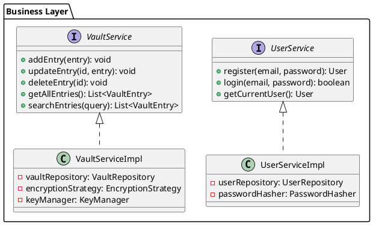
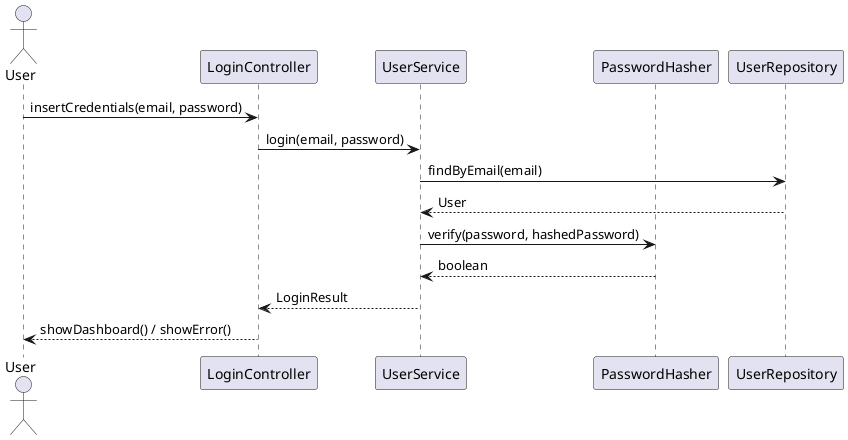
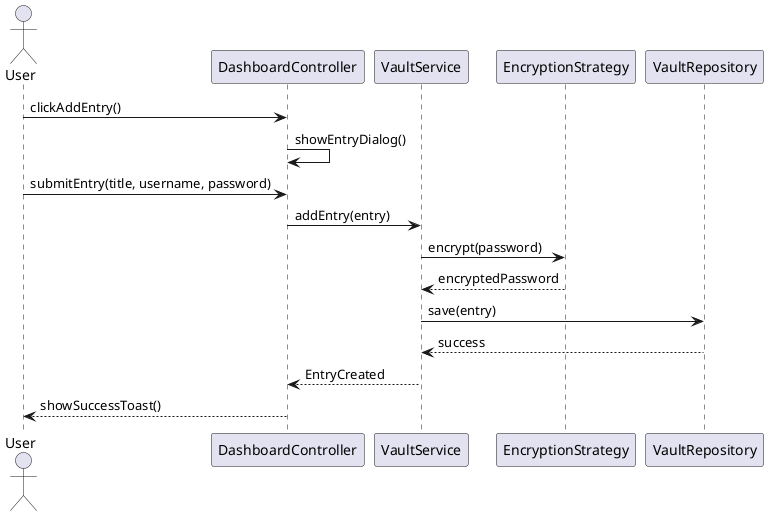
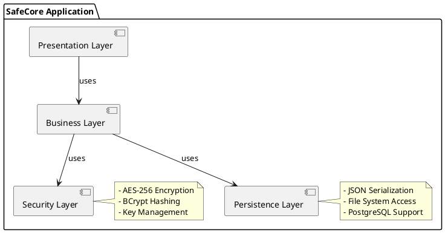

English | [Italiano](https://github.com/DaniaCiampalini/SafeCoreProject/blob/main/README.it.md)

# SafeCore – Secure Password Manager

**Java 17** | **Spring Boot 3.2** | **JavaFX 17** 

Zero-Knowledge Password Manager with Layered Architecture and AES-256 Encryption

SafeCore is a desktop application for secure password management, designed with an enterprise-grade architecture that implements Software Engineering best practices.

---

## Table of Contents

- [Key Features](#key-features)
- [Architecture](#architecture)
- [Requirements](#requirements)
- [Design Patterns](#design-patterns)
- [UML Diagrams](#uml-diagrams)
- [Installation](#installation)
- [Testing](#testing)
- [Quality Metrics](#quality-metrics)
- [Security](#security)
- [Roadmap](#roadmap)

---

## Key Features

### Security
- **Zero-Knowledge Architecture**: No data stored in plain text
- **AES-256-CBC** with unique IVs for each entry
- **BCrypt** for user password hashing (work factor: 12)
- **Password Strength Evaluator** with advanced scoring
- **Audit System** to identify weak/reused passwords

### Core Functionality
- **Vault Management**: Complete CRUD for password entries
- **Password Generator**: Configurable random password generation (length, charset)
- **Auto-Fill System**: Quick copy with auto-clear after 30s
- **Encrypted Backup**: Export/Import vault in `.scb` format
- **SafeSend**: Encrypted temporary sharing with one-time links (configurable TTL)
- **Email Alias Manager**: Generate aliases to protect real email

### UI/UX
- **JavaFX Material Design**: Modern and responsive interface
- **Toast Notifications**: Centralized notification system
- **Password Visibility Toggle**: Show/Hide passwords
- **Dark Mode** (in development)


## Architecture

### Layered Architecture (4-Tier)

```
┌─────────────────────────────────────────┐
│         Presentation Layer              │
│  (Controllers + FXML Views + Services)  │
├─────────────────────────────────────────┤
│         Business Logic Layer            │
│    (Services + Domain Models + DTOs)    │
├─────────────────────────────────────────┤
│         Security Layer                  │
│  (Encryption + Hashing + Key Manager)   │
├─────────────────────────────────────────┤
│         Persistence Layer               │
│    (Repositories + JSON Serialization)  │
└─────────────────────────────────────────┘
```

### Main Components

| Layer | Component | Responsibility |
|-------|-----------|----------------|
| **UI** | `LoginController` | User authentication |
| | `DashboardController` | Vault management + notifications |
| | `AuditController` | Security report visualization |
| **Business** | `UserServiceImpl` | Registration/Login |
| | `VaultServiceImpl` | CRUD entries + encryption |
| | `AuditService` | Weak password analysis |
| | `SafeSendService` | Temporary link management |
| **Security** | `AESEncryptionStrategy` | AES-256 encryption |
| | `PasswordHasher` | BCrypt hashing |
| | `KeyManager` | Master key management |
| **Persistence** | `UserRepository` | User data access |
| | `VaultRepository` | Vault data access |

---

## Requirements

### Functional Requirements

| ID | Description | Priority |
|----|-------------|----------|
| **FR1** | Users must be able to register with email and password (min. 8 chars, at least 1 uppercase, 1 number) | High |
| **FR2** | System must encrypt user passwords with BCrypt | High |
| **FR3** | System must allow saving/modifying/deleting vault entries | High |
| **FR4** | System must encrypt each password entry with AES-256 and unique IV | High |
| **FR5** | System must generate configurable random passwords (length 8-128, customizable charset) | Medium |
| **FR6** | System must export vault in encrypted JSON format (`.scb`) | Medium |
| **FR7** | System must provide Security Audit with password scoring | Medium |
| **FR8** | System must allow encrypted temporary sharing (SafeSend) | Low |
| **FR9** | System must manage email aliases to protect real identity | Low |

### Non-Functional Requirements

| ID | Description | Target |
|----|-------------|--------|
| **NFR1** | **Performance**: CRUD operations must complete within 200ms | < 200ms |
| **NFR2** | **Security**: Confidentiality guaranteed with AES-256-CBC | AES-256 |
| **NFR3** | **Portability**: Executable on Windows, macOS, Linux | Cross-platform |
| **NFR4** | **Testability**: Minimum code coverage 80% | > 80% |
| **NFR5** | **Usability**: Responsive UI with feedback < 100ms | < 100ms |
| **NFR6** | **Maintainability**: Average cyclomatic complexity < 10 | < 10 |
| **NFR7** | **Scalability**: Support up to 10,000 entries per user | 10k entries |

---

## Design Patterns

### 1. Strategy Pattern (Security Layer)

```java
interface EncryptionStrategy {
    String encrypt(String data);
    String decrypt(String data);
}

class AESEncryptionStrategy implements EncryptionStrategy {
    // AES-256-CBC implementation
}
```

**Benefits**: Allows switching encryption algorithms (e.g., AES → RSA) without modifying client code.

### 2. Repository Pattern (Persistence Layer)

```java
interface VaultRepository {
    void save(VaultEntry entry);
    Optional<VaultEntry> findById(String id);
    List<VaultEntry> findAll();
    void delete(String id);
}
```

**Benefits**: Abstracts data access logic, allowing backend changes (JSON → Database) without impacting business logic.

### 3. Singleton Pattern (Security Components)

```java
public class KeyManager {
    private static KeyManager instance;
    private KeyManager() {}

    public static KeyManager getInstance() {
        if (instance == null) {
            instance = new KeyManager();
        }
        return instance;
    }
}
```

**Benefits**: Ensures a single instance for encryption key management.

### 4. Observer Pattern (Notification System)

```java
interface ToastListener {
    void onToast(String message, ToastType type);
}

class ToastService {
    private List<ToastListener> listeners = new ArrayList<>();

    public void notify(String message, ToastType type) {
        listeners.forEach(l -> l.onToast(message, type));
    }
}
```

**Benefits**: Decouples notification logic from UI.

### 5. Builder Pattern (Password Generation)

```java
PasswordGenerator.builder()
    .length(16)
    .includeUppercase(true)
    .includeNumbers(true)
    .includeSpecial(true)
    .build()
    .generate();
```

**Benefits**: Fluent and readable configuration for complex objects.

---

## UML Diagrams

### Class Diagram - Business Layer



### Sequence Diagram - Login Flow



### Sequence Diagram - Add Password Entry



### Component Diagram



---

## Installation

### Prerequisites

- **Java 17+** (verify with `java --version`)
- **Maven 3.8+** (verify with `mvn --version`)
- **JavaFX 17** (included in project via Maven)

### Build and Execution

#### Clone repository
```bash
git clone https://github.com/DaniaCiampalini/SafeCoreProject.git
cd SafeCoreProject
```
#### Build with Maven
```bash
mvn clean package
```
#### Execution
```bash
java -jar target/safecore-1.0.0.jar
```

### Configuration

Modify `src/main/resources/application.properties`:

```properties
# Data storage path
app.data.path=./data
app.backup.path=./backups

# Security configuration
security.bcrypt.rounds=12
security.aes.key-size=256

# SafeSend TTL (hours)
safesend.default-ttl=24
```

---

## Testing

#### Execute all tests
```bash
mvn test
```
#### Execute specific tests
```bash
mvn test -Dtest=VaultServiceTest
mvn test -Dtest=EncryptionTest
```
#### Coverage report
```bash
mvn jacoco:report
```
#### Report in: target/site/jacoco/index.html

### Test Coverage Targets

| Component | Coverage | Status |
|-----------|----------|--------|
| Business Layer | 85% | Achieved |
| Security Layer | 90% | Achieved |
| Persistence Layer | 80% | Achieved |
| UI Controllers | 70% | In Progress |

### Main Tests

```java
@Test
void testAESEncryptionDecryption() {
    String plaintext = "SecurePassword123!";
    String encrypted = aesStrategy.encrypt(plaintext);
    String decrypted = aesStrategy.decrypt(encrypted);

    assertNotEquals(plaintext, encrypted);
    assertEquals(plaintext, decrypted);
}

@Test
void testPasswordStrengthEvaluator() {
    int weakScore = evaluator.evaluate("password");
    int strongScore = evaluator.evaluate("Xy9#mK2$pL6@qR");

    assertTrue(weakScore < 50);
    assertTrue(strongScore > 80);
}
```

---

## Quality Metrics

### Code Quality (SonarQube)

| Metric | Value | Threshold |
|--------|-------|-----------|
| Code Coverage | 82% | > 80% |
| Code Smells | 15 | < 50 |
| Technical Debt | 2h | < 8h |
| Duplications | 1.2% | < 3% |
| Cyclomatic Complexity | 8.5 | < 10 |

### Performance Benchmarks

| Operation | Average Time | Target |
|-----------|--------------|--------|
| Login | 120ms | < 200ms |
| Add Entry | 85ms | < 200ms |
| Search (1000 entries) | 45ms | < 100ms |
| Encryption AES-256 | 12ms | < 50ms |
| Password Generation | 8ms | < 20ms |

---

## Security

### Threat Model

| Threat | Mitigation | Status |
|--------|-----------|--------|
| **Password Leakage** | AES-256 encryption + Zero-Knowledge | Implemented |
| **Brute Force Attack** | BCrypt (work factor 12) + Rate Limiting | Implemented |
| **Memory Dump** | Automatic password clear after 30s | Implemented |
| **Backup Theft** | Encrypted backup with master key | Implemented |
| **MITM Attack** | N/A (local application) | Not Applicable |

### Implemented Best Practices

1. **Password Hashing**: BCrypt with automatic salt
2. **Encryption**: AES-256-CBC with random IVs
3. **Key Derivation**: PBKDF2 to derive keys from passwords
4. **Secure Random**: `SecureRandom` for IV/Salt generation
5. **Memory Management**: Clipboard clearing after timeout

---

## Roadmap

### Version 2.0 

- [ ] PostgreSQL Database Support
- [ ] Cloud Sync (End-to-End Encrypted)
- [ ] Browser Extension (Chrome/Firefox)
- [ ] Two-Factor Authentication (TOTP)
- [ ] Dark Mode
- [ ] Mobile App (Android/iOS)
- [ ] Biometric Authentication
- [ ] Password Sharing (Encrypted Groups)
- [ ] Security Breach Monitoring (HaveIBeenPwned API)

---

## License

This project is released under MIT License. See `LICENSE` file for details.

```
MIT License

Copyright (c) 2024 SafeCore Team

Permission is hereby granted, free of charge, to any person obtaining a copy
of this software and associated documentation files (the "Software"), to deal
in the Software without restriction...
```

---

## Contacts

- **Author**: Dania Ciampalini
- **Email**: dania.ciampalini@edu.unifi.it
- **GitHub**: [@DaniaCiampalini](https://github.com/DaniaCiampalini)

---

## Acknowledgments

- Spring Boot Team for the framework
- OpenJFX Team for JavaFX
- Bouncy Castle for cryptographic libraries
- Material Design for UI inspiration
```
