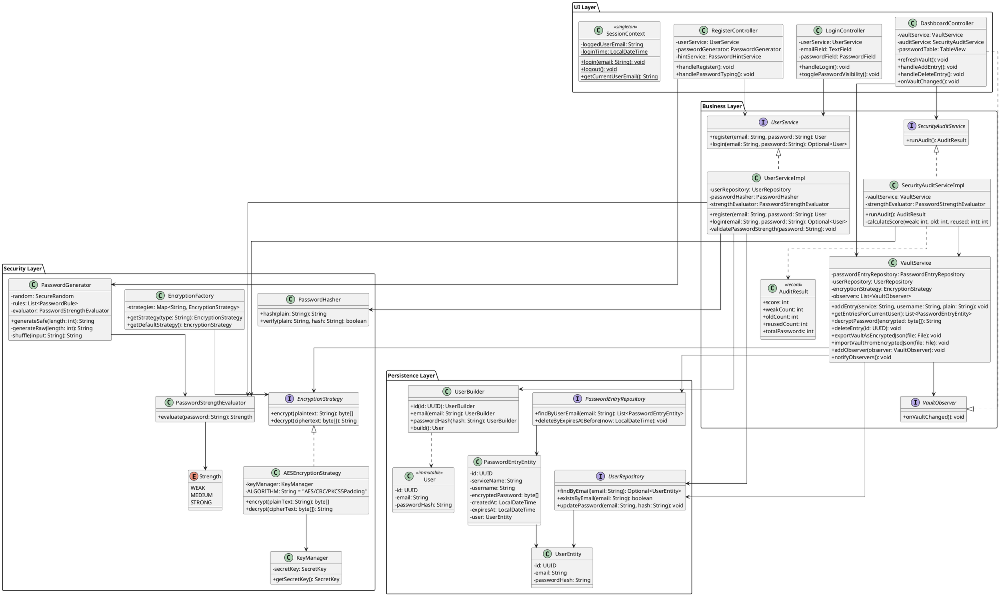
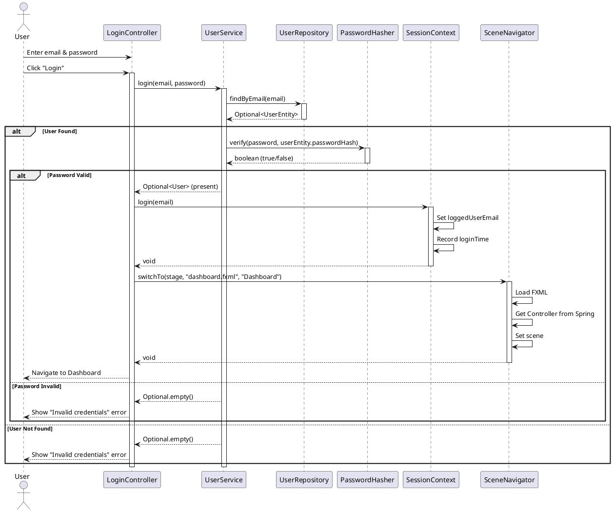
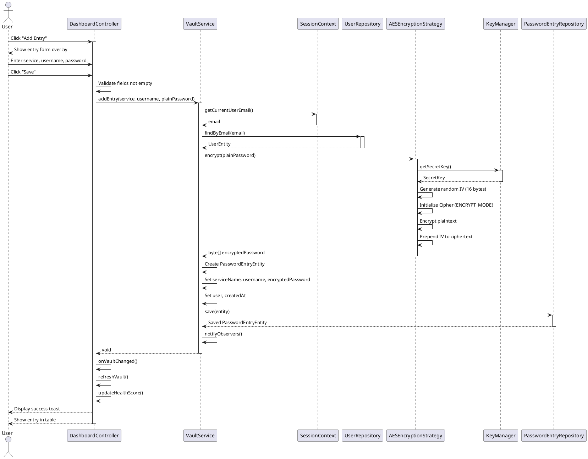
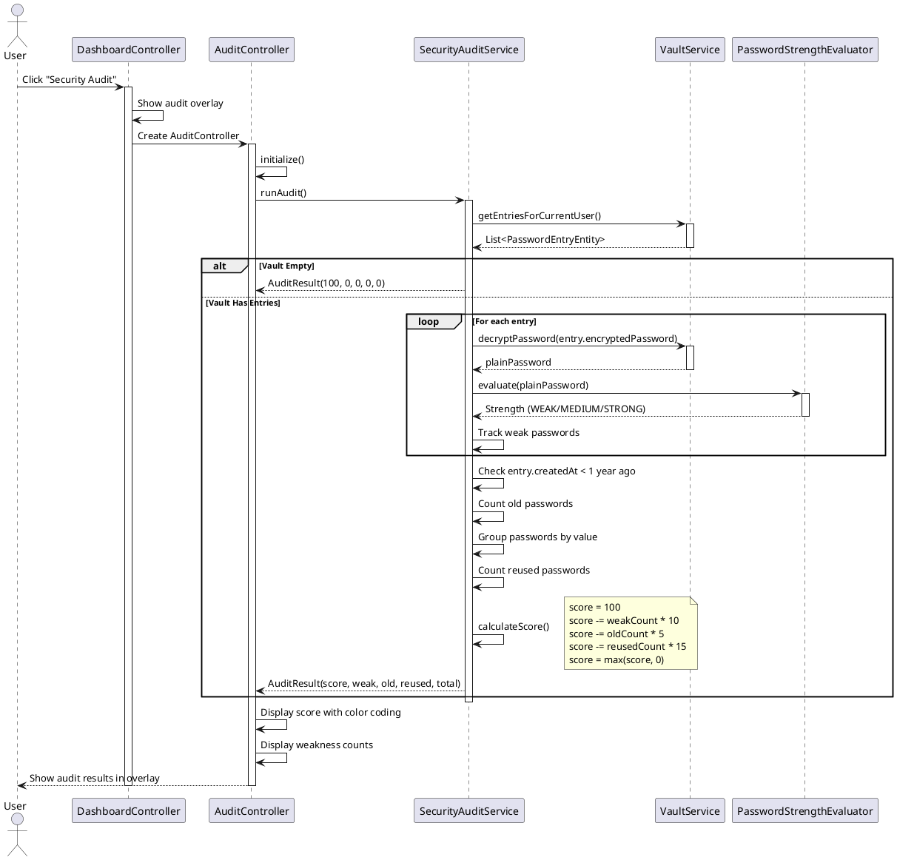
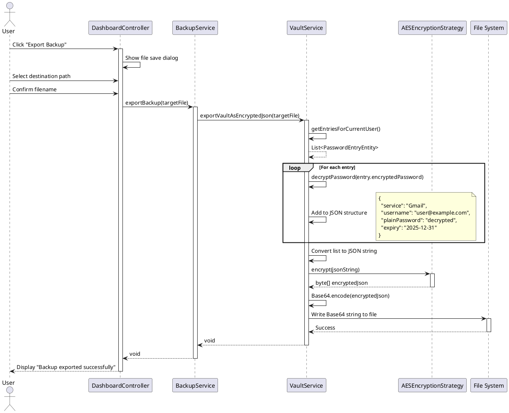
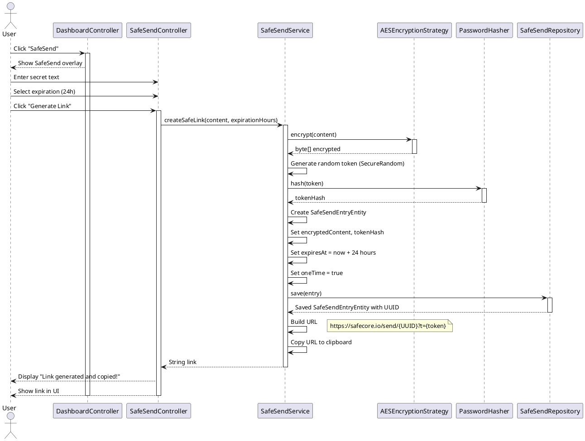
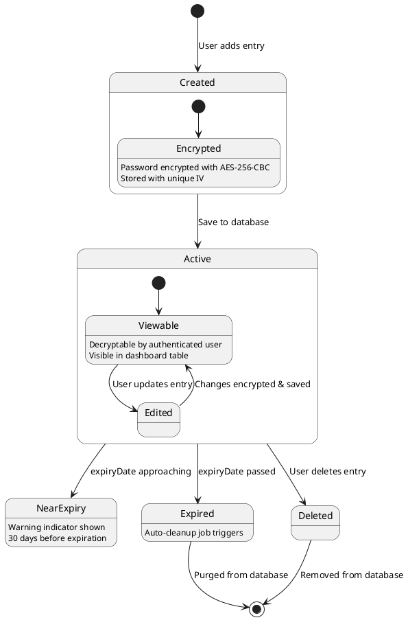
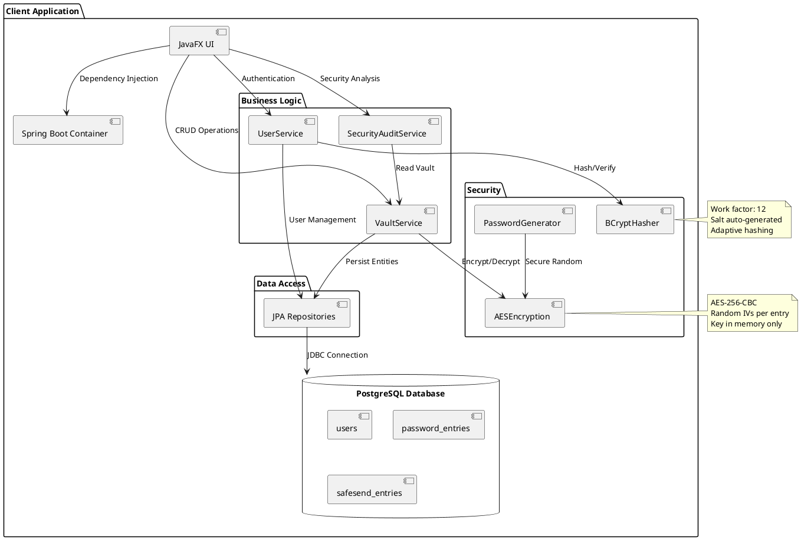

# SafeCore - Secure Password Manager

[English] | [Italiano](README.it.md)

A zero-knowledge desktop password manager built with enterprise-grade architecture, implementing Software Engineering best practices through layered design, security patterns, and comprehensive testing.

## Table of Contents

- [Overview](#overview)
- [Key Features](#key-features)
- [Architecture](#architecture)
- [Technology Stack](#technology-stack)
- [Project Structure](#project-structure)
- [Design Patterns](#design-patterns)
- [Security Architecture](#security-architecture)
- [Use Cases](#use-cases)
- [UML Diagrams](#uml-diagrams)
- [Installation](#installation)
- [Configuration](#configuration)
- [Usage](#usage)
- [Testing](#testing)
- [API Documentation](#api-documentation)
- [Contributing](#contributing)
- [License](#license)
- [Acknowledgments](#acknowledgments)

## Overview

SafeCore is a desktop application for secure password management designed with a layered architecture that separates concerns across UI, business logic, security, and persistence layers. The application implements zero-knowledge architecture where no sensitive data is stored in plain text, ensuring maximum security for user credentials.

The project demonstrates professional software engineering practices including:
- Clean Architecture with clear separation of concerns
- Design Patterns (Strategy, Repository, Builder, Observer, Singleton, Factory, Dependency Injection)
- Comprehensive unit and integration testing
- Security-first design with AES-256-CBC encryption
- Modern JavaFX Material Design UI
- Spring Boot dependency injection and transaction management

## Key Features

### Security Features

- **Zero-Knowledge Architecture**: All sensitive data is encrypted before storage
- **AES-256-CBC Encryption**: Industry-standard encryption with unique initialization vectors
- **BCrypt Password Hashing**: User passwords hashed with work factor 12
- **Password Strength Evaluation**: Real-time password strength analysis with scoring system
- **Security Audit System**: Comprehensive vault analysis identifying weak, old, and reused passwords
- **Secure Password Generator**: Cryptographically secure random password generation with customizable complexity

### Core Functionality

- **Vault Management**: Complete CRUD operations for password entries with encrypted storage
- **User Authentication**: Secure registration and login with password strength validation
- **Account Management**: Secure account deletion with data sanitization and confirmation phrase
- **Password Expiration**: Optional password expiration dates with automatic cleanup
- **Search and Filter**: Real-time search across service names and usernames
- **Backup and Restore**: Encrypted vault export/import with .safe file format
- **SafeSend**: Secure one-time secret sharing with time-limited expiration

### User Experience

- **Modern Material Design UI**: Clean and intuitive JavaFX interface
- **Session Management**: Centralized user session with automatic logout
- **Password Visibility Toggle**: Show/hide password functionality
- **Real-time Feedback**: Password strength indicators and validation hints
- **Health Score Dashboard**: Visual security score based on vault audit results
- **Responsive Design**: Adaptive layout with overlay dialogs and animations

## Architecture

### Layered Architecture (4-Tier)

```
┌─────────────────────────────────────────────────────────────┐
│                    PRESENTATION LAYER                       │
│                      (JavaFX UI)                            │
│  - Controllers (Login, Dashboard, Register, Audit)          │
│  - Navigation System (SceneNavigator)                       │
│  - Session Management (SessionContext)                      │
│  - Global Exception Handler                                 │
└─────────────────────────────────────────────────────────────┘
                            ↓
┌─────────────────────────────────────────────────────────────┐
│                     BUSINESS LAYER                          │
│                   (Service Interfaces)                      │
│  - VaultService (entry management + encryption)             │
│  - UserService (registration + authentication)              │
│  - SecurityAuditService (vault analysis)                    │
│  - SafeSendService (secure sharing)                         │
│  - BackupService (export/import)                            │
│  - PasswordHintService (strength validation)                │
└─────────────────────────────────────────────────────────────┘
                            ↓
┌─────────────────────────────────────────────────────────────┐
│                     SECURITY LAYER                          │
│                  (Encryption & Hashing)                     │
│  - EncryptionStrategy (interface)                           │
│  - AESEncryptionStrategy (AES-256-CBC implementation)       │
│  - PasswordHasher (BCrypt with salt)                        │
│  - PasswordGenerator (secure random generation)             │
│  - PasswordStrengthEvaluator (strength scoring)             │
│  - KeyManager (encryption key management)                   │
└─────────────────────────────────────────────────────────────┘
                            ↓
┌─────────────────────────────────────────────────────────────┐
│                   PERSISTENCE LAYER                         │
│                  (JPA Repositories)                         │
│  - UserRepository (user CRUD)                               │
│  - PasswordEntryRepository (entry CRUD)                     │
│  - SafeSendRepository (temporary secret storage)            │
│  - PostgreSQL Database (cloud-hosted relational DB)         │
└─────────────────────────────────────────────────────────────┘
```

### Component Responsibilities

| Layer | Component | Responsibilities |
|-------|-----------|------------------|
| **UI** | `LoginController` | User authentication UI and form validation |
| | `RegisterController` | User registration with real-time password strength feedback |
| | `DashboardController` | Main vault management, entry CRUD, health score display |
| | `AuditController` | Security audit visualization and recommendations |
| | `SceneNavigator` | Centralized view navigation with Spring context injection |
| | `SessionContext` | Singleton session management with user state tracking |
| **Business** | `VaultService` | Entry encryption/decryption, CRUD operations, backup/restore |
| | `UserService` | User registration, login validation, password strength checking |
| | `SecurityAuditService` | Vault analysis, weakness detection, health score calculation |
| | `SafeSendService` | Temporary secret creation, one-time access management |
| **Security** | `AESEncryptionStrategy` | AES-256-CBC encryption with random IVs |
| | `PasswordHasher` | BCrypt hashing with configurable work factor |
| | `PasswordGenerator` | Cryptographically secure password generation |
| | `PasswordStrengthEvaluator` | Multi-factor password strength analysis |
| **Persistence** | `UserRepository` | User entity persistence and query operations |
| | `PasswordEntryRepository` | Encrypted password entry storage |
| | `PasswordEntryEntity` | JPA entity with Many-to-One relationship to User |
| | `UserEntity` | JPA entity with unique email constraint |

## Technology Stack

### Core Technologies

- **Java 17**: Modern Java LTS version with records, sealed classes, and enhanced pattern matching
- **Spring Boot 3.2.2**: Enterprise framework for dependency injection, transaction management, and data access
- **JavaFX 17**: Modern desktop UI framework with FXML declarative layouts
- **PostgreSQL**: Production-grade relational database with cloud hosting (Neon)

### Security Libraries

- **JBCrypt 0.4**: BCrypt password hashing implementation
- **Java Cryptography Extension (JCE)**: AES-256 encryption support

### Testing Frameworks

- **JUnit 5**: Modern testing framework with parameterized and nested tests
- **Mockito**: Mocking framework for unit testing
- **Spring Boot Test**: Integration testing support with transaction rollback
- **TestFX**: JavaFX UI testing framework
- **JaCoCo**: Code coverage analysis tool

### Build Tools

- **Maven**: Project management and dependency resolution
- **Spring Boot Maven Plugin**: Executable JAR packaging

## Project Structure

```
SafeCoreProject/
├── src/
│   ├── main/
│   │   ├── java/com/safecore/
│   │   │   ├── SafeCoreApplication.java          # Main application entry point
│   │   │   ├── business/                         # Business logic layer
│   │   │   │   ├── domain/                       # Domain models (immutable)
│   │   │   │   │   ├── User.java
│   │   │   │   │   ├── UserBuilder.java
│   │   │   │   │   ├── PasswordEntry.java
│   │   │   │   │   ├── UserFactory.java
│   │   │   │   │   └── AuditResult.java
│   │   │   │   ├── exception/                    # Custom exceptions
│   │   │   │   │   ├── SafeCoreException.java
│   │   │   │   │   ├── UserAlreadyExistsException.java
│   │   │   │   │   ├── UserNotFoundException.java
│   │   │   │   │   ├── WeakPasswordException.java
│   │   │   │   │   ├── InvalidTokenException.java
│   │   │   │   │   ├── ExpiredLinkException.java
│   │   │   │   │   └── LinkNotFoundException.java
│   │   │   │   ├── hints/                        # Password validation rules
│   │   │   │   │   ├── HintLevel.java
│   │   │   │   │   ├── PasswordHint.java
│   │   │   │   │   └── rules/
│   │   │   │   │       ├── PasswordRule.java
│   │   │   │   │       ├── MinLengthRule.java
│   │   │   │   │       └── ComplexityRule.java
│   │   │   │   └── service/                      # Service interfaces & implementations
│   │   │   │       ├── UserService.java
│   │   │   │       ├── VaultService.java
│   │   │   │       ├── SecurityAuditService.java
│   │   │   │       ├── SafeSendService.java
│   │   │   │       ├── BackupService.java
│   │   │   │       ├── PasswordHintService.java
│   │   │   │       ├── VaultObserver.java
│   │   │   │       └── impl/                     # Service implementations
│   │   │   │           ├── UserServiceImpl.java
│   │   │   │           ├── PasswordServiceImpl.java
│   │   │   │           ├── SecurityAuditServiceImpl.java
│   │   │   │           ├── SafeSendServiceImpl.java
│   │   │   │           └── BackupServiceImpl.java
│   │   │   ├── persistence/                      # Data access layer
│   │   │   │   ├── entity/                       # JPA entities
│   │   │   │   │   ├── UserEntity.java
│   │   │   │   │   ├── PasswordEntryEntity.java
│   │   │   │   │   └── SafeSendEntryEntity.java
│   │   │   │   └── repository/                   # Spring Data repositories
│   │   │   │       ├── UserRepository.java
│   │   │   │       ├── PasswordEntryRepository.java
│   │   │   │       └── SafeSendRepository.java
│   │   │   ├── security/                         # Security layer
│   │   │   │   ├── EncryptionStrategy.java       # Strategy pattern interface
│   │   │   │   ├── AESEncryptionStrategy.java
│   │   │   │   ├── EncryptionFactory.java
│   │   │   │   ├── KeyManager.java
│   │   │   │   ├── PasswordHasher.java
│   │   │   │   ├── PasswordGenerator.java
│   │   │   │   └── PasswordStrengthEvaluator.java
│   │   │   └── ui/                               # Presentation layer
│   │   │       ├── AppLauncher.java              # JavaFX launcher
│   │   │       ├── GlobalExceptionHandler.java
│   │   │       ├── controller/                   # UI controllers
│   │   │       │   ├── LoginController.java
│   │   │       │   ├── RegisterController.java
│   │   │       │   ├── DashboardController.java
│   │   │       │   ├── AuditController.java
│   │   │       │   ├── SafeSendController.java
│   │   │       │   ├── AddEntryController.java
│   │   │       │   ├── SettingsController.java
│   │   │       │   └── BackupController.java
│   │   │       ├── navigation/
│   │   │       │   └── SceneNavigator.java
│   │   │       └── session/
│   │   │           └── SessionContext.java
│   │   └── resources/
│   │       ├── application.properties            # Spring configuration
│   │       ├── style.css                         # Application stylesheet
│   │       └── com/safecore/ui/view/            # FXML views
│   │           ├── login.fxml
│   │           ├── register.fxml
│   │           ├── dashboard.fxml
│   │           ├── audit-view.fxml
│   │           ├── safesend-view.fxml
│   │           └── settings-view.fxml
│   └── test/
│       ├── java/com/safecore/                   # Test suite
│       │   ├── SafeCoreIntegrationTest.java
│       │   ├── business/service/
│       │   │   ├── UserServiceTest.java
│       │   │   ├── PasswordServiceTest.java
│       │   │   ├── SecurityAuditServiceTest.java
│       │   │   ├── BackupIntegrationTest.java
│       │   │   └── SafeSendServiceTest.java
│       │   ├── business/exception/
│       │   │   ├── UserNotFoundExceptionTest.java
│       │   │   ├── UserAlreadyExistsExceptionTest.java
│       │   │   ├── InvalidTokenExceptionTest.java
│       │   │   ├── ExpiredLinkExceptionTest.java
│       │   │   ├── LinkNotFoundExceptionTest.java
│       │   │   ├── SafeCoreExceptionTest.java
│       │   │   └── WeakPasswordExceptionTest.java
│       │   ├── business/hints/
│       │   │   └── PasswordHintServiceTest.java
│       │   ├── security/
│       │   │   ├── AESEncryptionStrategyTest.java
│       │   │   ├── AESEncryptionPerformanceTest.java
│       │   │   ├── PasswordGeneratorTest.java
│       │   │   ├── PasswordStrengthEvaluatorTest.java
│       │   │   ├── PasswordHasherTest.java
│       │   │   └── PasswordHasherPerformanceTest.java
│       │   ├── persistence/repository/
│       │   │   ├── SafeSendRepositoryTest.java
│       │   │   └── UserRepositoryTest.java
│       │   └── ui/
│       │       ├── TestFXBaseTest.java
│       │       └── controller/
│       │           ├── LoginControllerTest.java
│       │           ├── RegisterControllerTest.java
│       │           ├── SafeSendControllerTest.java
│       │           └── SettingsControllerTest.java
│       └── resources
│           └── application-test.properties
├── docs/
│   └── uml/
│       ├── class-diagram.puml                   # Complete system class diagram
│       ├── class-diagram-part1-ui-navigation.puml
│       ├── class-diagram-part2-business-logic.puml
│       ├── class-diagram-part3-persistence.puml
│       ├── class-diagram-part4-security.puml
│       ├── component-diagram.puml
│       ├── package-diagram.puml
│       ├── sequence-login.puml
│       ├── sequence-register.puml
│       ├── sequence-save-entry.puml
│       ├── sequence-audit.puml
│       └── use-case.puml
├── pom.xml                                      # Maven configuration
├── README.md                                    # This file
└── README.it.md                                 # Italian documentation
```

## Design Patterns

### 1. Strategy Pattern (Encryption)

The Strategy pattern allows switching between different encryption algorithms without modifying client code.

```java
public interface EncryptionStrategy {
    byte[] encrypt(String plaintext);
    String decrypt(byte[] ciphertext);
}

@Component
public class AESEncryptionStrategy implements EncryptionStrategy {
    private final KeyManager keyManager;
    
    @Override
    public byte[] encrypt(String plainText) {
        // AES-256-CBC implementation with random IV
        Cipher cipher = Cipher.getInstance("AES/CBC/PKCS5Padding");
        byte[] iv = new byte[16];
        new SecureRandom().nextBytes(iv);
        IvParameterSpec ivSpec = new IvParameterSpec(iv);
        cipher.init(Cipher.ENCRYPT_MODE, keyManager.getSecretKey(), ivSpec);
        byte[] encrypted = cipher.doFinal(plainText.getBytes(StandardCharsets.UTF_8));
        
        // Prepend IV to ciphertext for decryption
        byte[] result = new byte[iv.length + encrypted.length];
        System.arraycopy(iv, 0, result, 0, iv.length);
        System.arraycopy(encrypted, 0, result, iv.length, encrypted.length);
        return result;
    }
    
    @Override
    public String decrypt(byte[] cipherText) {
        // Extract IV and decrypt
        byte[] iv = new byte[16];
        byte[] encrypted = new byte[cipherText.length - 16];
        System.arraycopy(cipherText, 0, iv, 0, 16);
        System.arraycopy(cipherText, 16, encrypted, 0, encrypted.length);
        
        Cipher cipher = Cipher.getInstance("AES/CBC/PKCS5Padding");
        cipher.init(Cipher.DECRYPT_MODE, keyManager.getSecretKey(), new IvParameterSpec(iv));
        return new String(cipher.doFinal(encrypted), StandardCharsets.UTF_8);
    }
}
```

**Benefits**:
- Easy to add new encryption algorithms (RSA, ChaCha20, etc.)
- Client code depends on interface, not implementation
- Encryption logic encapsulated and testable in isolation

### 2. Repository Pattern (Data Access)

The Repository pattern abstracts data access logic, allowing database changes without impacting business logic.

```java
@Repository
public interface PasswordEntryRepository extends JpaRepository<PasswordEntryEntity, UUID> {
    List<PasswordEntryEntity> findByUserEmail(String email);
    List<PasswordEntryEntity> findByUser(UserEntity user);
    void deleteByExpiresAtBefore(LocalDateTime now);
}
```

**Benefits**:
- Database implementation can change without affecting services
- Centralized query logic with Spring Data JPA method naming
- Easy to mock for unit testing
- Built-in transaction management

### 3. Builder Pattern (Domain Objects)

The Builder pattern enables fluent and readable construction of complex immutable objects.

```java
public final class PasswordEntry {
    private final UUID id;
    private final String serviceName;
    private final String username;
    private final byte[] encryptedPassword;
    private final LocalDateTime createdAt;

    private PasswordEntry(Builder builder) {
        this.id = builder.id;
        this.serviceName = builder.serviceName;
        this.username = builder.username;
        this.encryptedPassword = builder.encryptedPassword != null 
            ? builder.encryptedPassword.clone() : null;
        this.createdAt = builder.createdAt;
    }

    public static class Builder {
        private UUID id;
        private String serviceName;
        private String username;
        private byte[] encryptedPassword;
        private LocalDateTime createdAt;

        public Builder id(UUID id) { 
            this.id = id; 
            return this; 
        }
        
        public Builder serviceName(String sn) { 
            this.serviceName = sn; 
            return this; 
        }
        
        public Builder username(String un) { 
            this.username = un; 
            return this; 
        }
        
        public Builder encryptedPassword(byte[] ep) { 
            this.encryptedPassword = ep; 
            return this; 
        }
        
        public Builder createdAt(LocalDateTime ca) { 
            this.createdAt = ca; 
            return this; 
        }

        public PasswordEntry build() {
            Objects.requireNonNull(serviceName, "Service name required");
            Objects.requireNonNull(username, "Username required");
            Objects.requireNonNull(encryptedPassword, "Encrypted password required");
            if (createdAt == null) this.createdAt = LocalDateTime.now();
            return new PasswordEntry(this);
        }
    }
}

// Usage
PasswordEntry entry = new PasswordEntry.Builder()
    .serviceName("Gmail")
    .username("user@example.com")
    .encryptedPassword(encryptedBytes)
    .createdAt(LocalDateTime.now())
    .build();
```

**Benefits**:
- Immutable objects ensure thread safety
- Fluent API improves code readability
- Compile-time validation of required fields
- Flexible parameter combinations

### 4. Observer Pattern (Vault Updates)

The Observer pattern enables reactive UI updates when vault data changes.

```java
public interface VaultObserver {
    void onVaultChanged();
}

@Service
public class VaultService {
    private final List<VaultObserver> observers = new ArrayList<>();

    public void addObserver(VaultObserver observer) { 
        observers.add(observer); 
    }
    
    public void notifyObservers() { 
        observers.forEach(VaultObserver::onVaultChanged); 
    }

    @Transactional
    public void addEntry(String service, String username, String plain) {
        // ... save entry logic ...
        notifyObservers(); // Notify all observers
    }
}

@Component
public class DashboardController implements VaultObserver {
    @Override
    public void onVaultChanged() {
        refreshVault(); // Update UI table
        updateHealthScore(); // Recalculate security score
    }
}
```

**Benefits**:
- Decoupled communication between service and UI
- Multiple observers can react to same event
- Easy to add new observers without modifying VaultService

### 5. Singleton Pattern (Session Management)

The Singleton pattern ensures a single instance for application-wide user session.

```java
public final class SessionContext {
    private static volatile String loggedUserEmail;
    private static LocalDateTime loginTime;

    private SessionContext() {
        // Private constructor prevents instantiation
    }

    public static void login(String email) {
        if (email == null || email.isBlank()) {
            throw new IllegalArgumentException("Invalid session email");
        }
        loggedUserEmail = email;
        loginTime = LocalDateTime.now();
    }

    public static void logout() {
        loggedUserEmail = null;
        loginTime = null;
    }

    public static boolean isLoggedIn() {
        return loggedUserEmail != null;
    }

    public static String getCurrentUserEmail() {
        if (!isLoggedIn()) {
            throw new IllegalStateException("No user logged in");
        }
        return loggedUserEmail;
    }
}
```

**Benefits**:
- Global access point for session state
- Thread-safe with volatile keyword
- Prevents multiple session instances

### 6. Factory Pattern (Encryption Strategy Selection)

The Factory pattern centralizes creation logic for encryption strategies.

```java
@Component
public class EncryptionFactory {
    private final Map<String, EncryptionStrategy> strategies;

    public EncryptionFactory(List<EncryptionStrategy> strategyList) {
        this.strategies = strategyList.stream()
            .collect(Collectors.toMap(
                s -> s.getClass().getSimpleName()
                    .replace("EncryptionStrategy", "")
                    .toUpperCase(),
                Function.identity()
            ));
    }

    public EncryptionStrategy getStrategy(String type) {
        EncryptionStrategy strategy = strategies.get(type.toUpperCase());
        if (strategy == null) {
            throw new IllegalArgumentException("Unsupported encryption: " + type);
        }
        return strategy;
    }

    public EncryptionStrategy getDefaultStrategy() {
        return getStrategy("AES");
    }
}
```

**Benefits**:
- Centralized strategy creation and configuration
- Easy to add new encryption algorithms via Spring
- Runtime strategy selection based on requirements

### 7. Dependency Injection (Spring Framework)

Spring's DI container manages object lifecycles and dependencies.

```java
@Service
public class VaultService {
    private final PasswordEntryRepository repository;
    private final UserRepository userRepository;
    private final EncryptionStrategy encryptionStrategy;

    // Constructor injection (recommended)
    public VaultService(PasswordEntryRepository repository,
                       UserRepository userRepository,
                       EncryptionFactory encryptionFactory) {
        this.repository = repository;
        this.userRepository = userRepository;
        this.encryptionStrategy = encryptionFactory.getDefaultStrategy();
    }
}
```

**Benefits**:
- Loose coupling between components
- Easy to mock dependencies for unit testing
- Centralized configuration and lifecycle management
- Promotes interface-based programming

## Security Architecture

### Encryption Implementation

#### AES-256-CBC Encryption

```
Plaintext Password: "MySecretPass123!"
           ↓
    [Key Manager]
    SecureRandom generates 256-bit key
           ↓
    [AES Cipher Init]
    Generate random 128-bit IV
    Mode: CBC (Cipher Block Chaining)
    Padding: PKCS5
           ↓
    [Encryption]
    Encrypt plaintext using key + IV
           ↓
    [Storage Format]
    [IV (16 bytes)][Encrypted Data (variable)]
           ↓
    Store in database as byte[]
```

**Security Properties**:
- Each password has unique IV (prevents pattern detection)
- 256-bit key provides 2^256 possible keys
- CBC mode ensures identical plaintexts produce different ciphertexts
- Key stored in memory only, never persisted

#### BCrypt Password Hashing

```
User Password: "MyMasterPass!"
           ↓
    [BCrypt Algorithm]
    Work Factor: 12 (2^12 = 4096 iterations)
    Salt: 128-bit random value (auto-generated)
           ↓
    [Hashing Process]
    Blowfish cipher + salt + iterations
           ↓
    [Result]
    $2a$12$[22-char salt][31-char hash]
           ↓
    Store in UserEntity.passwordHash
```

**Security Properties**:
- Adaptive hashing (work factor increases with hardware)
- Unique salt per password prevents rainbow table attacks
- Computationally expensive (mitigates brute force)
- Industry-standard algorithm (OWASP recommended)

### Zero-Knowledge Architecture

SafeCore implements true zero-knowledge security:

1. **Master Password Never Stored**: User passwords are hashed with BCrypt, original value never persisted
2. **Vault Entries Encrypted**: All passwords encrypted with AES-256 before database storage
3. **Unique IVs**: Each encryption uses fresh random IV (no pattern leakage)
4. **Key in Memory**: Encryption key generated at startup, never written to disk
5. **Session-Based Decryption**: Passwords decrypted only when user is authenticated

### Password Strength Evaluation

The system evaluates password strength using multiple criteria:

```java
@Component
public class PasswordStrengthEvaluator {
    public Strength evaluate(String password) {
        if (password == null || password.length() < 8) return Strength.WEAK;

        boolean hasLower = password.matches(".*[a-z].*");
        boolean hasUpper = password.matches(".*[A-Z].*");
        boolean hasDigit = password.matches(".*\\d.*");
        boolean hasSymbol = password.matches(".*[^a-zA-Z0-9].*");

        int score = Stream.of(hasLower, hasUpper, hasDigit, hasSymbol)
            .mapToInt(b -> b ? 1 : 0)
            .sum();

        if (score <= 2 || password.length() < 8) return Strength.WEAK;
        if (score == 3) return Strength.MEDIUM;
        return Strength.STRONG;
    }

    public enum Strength { WEAK, MEDIUM, STRONG }
}
```

**Criteria**:
- Length: Minimum 8 characters (12+ recommended)
- Lowercase letters: [a-z]
- Uppercase letters: [A-Z]
- Digits: [0-9]
- Special characters: [!@#$%^&*()-_=+[]{}<>]

**Scoring**:
- WEAK: 0-2 criteria met OR < 8 characters
- MEDIUM: 3 criteria met
- STRONG: All 4 criteria met

### Security Audit System

The audit service analyzes vault security and calculates health score:

```java
@Service
public class SecurityAuditServiceImpl implements SecurityAuditService {
    @Override
    public AuditResult runAudit() {
        List<PasswordEntryEntity> entries = vaultService.getEntriesForCurrentUser();
        
        // Decrypt all passwords for analysis
        List<String> decryptedPasswords = entries.stream()
            .map(e -> vaultService.decryptPassword(e.getEncryptedPassword()))
            .toList();

        // Analyze weaknesses
        int weakCount = countWeakPasswords(decryptedPasswords);
        int oldCount = countOldPasswords(entries);
        int reusedCount = countReusedPasswords(decryptedPasswords);

        // Calculate health score
        int score = 100 - (weakCount * 10) - (oldCount * 5) - (reusedCount * 15);
        
        return new AuditResult(Math.max(score, 0), weakCount, oldCount, reusedCount, entries.size());
    }
}
```

**Audit Criteria**:
- **Weak Passwords**: -10 points each (passwords not meeting strength requirements)
- **Old Passwords**: -5 points each (passwords older than 1 year)
- **Reused Passwords**: -15 points per reuse (same password used multiple times)

**Health Score Ranges**:
- 80-100: Excellent (green indicator)
- 50-79: Good (yellow indicator)
- 0-49: Poor (red indicator)

## Use Cases

### UC-1: User Registration

**Primary Actor**: New User

**Preconditions**:
- Application launched
- User not authenticated

**Main Success Scenario**:
1. User clicks "Register" on login screen
2. System displays registration form
3. User enters email address
4. User enters master password
5. System validates password strength in real-time
6. User confirms master password
7. System validates:
    - Email format is valid
    - Email not already registered
    - Passwords match
    - Password meets minimum strength (MEDIUM or STRONG)
8. System hashes password with BCrypt
9. System creates UserEntity with hashed password
10. System saves user to database
11. System displays success message
12. System redirects to login screen

**Alternative Flows**:
- 5a. Password is WEAK:
    1. System displays strength indicator in red
    2. System shows specific weakness hints
    3. User modifies password
    4. Return to step 5

- 7a. Email already registered:
    1. System displays "Account exists" error
    2. System suggests login instead
    3. Use case ends

- 7b. Passwords don't match:
    1. System highlights mismatch error
    2. User corrects password
    3. Return to step 7

**Postconditions**:
- New user account created with encrypted credentials
- User can log in with email and master password

---

### UC-2: User Login

**Primary Actor**: Registered User

**Preconditions**:
- User has registered account
- User not currently authenticated

**Main Success Scenario**:
1. User enters email address
2. User enters master password
3. User clicks "Login" button
4. System retrieves UserEntity by email
5. System verifies password using BCrypt
6. System initializes SessionContext with user email
7. System records login timestamp
8. System redirects to Dashboard
9. System loads user's encrypted vault entries
10. System displays vault table with decrypted data

**Alternative Flows**:
- 4a. Email not found:
    1. System displays "Invalid credentials" error
    2. System does not reveal whether email or password was wrong (security)
    3. Use case ends

- 5a. Password verification fails:
    1. System displays "Invalid credentials" error
    2. Use case ends

**Postconditions**:
- User authenticated with active session
- Dashboard loaded with user's vault data
- Security audit score calculated and displayed

---

### UC-3: Add Password Entry

**Primary Actor**: Authenticated User

**Preconditions**:
- User logged in
- Dashboard displayed

**Main Success Scenario**:
1. User clicks "Add Entry" button
2. System displays entry form overlay
3. User enters:
    - Service name (e.g., "Gmail")
    - Username/email
    - Password (manual or generated)
    - Optional: Expiration date
4. System validates all fields are non-empty
5. System encrypts password using AES-256-CBC
6. System generates random 128-bit IV
7. System creates PasswordEntryEntity
8. System associates entry with current user
9. System saves entry to database
10. System notifies VaultObservers
11. System refreshes dashboard table
12. System updates health score
13. System displays success notification

**Alternative Flows**:
- 3a. User clicks "Generate Password":
    1. System shows password generator form
    2. User selects length (12-32 characters)
    3. System generates cryptographically secure random password
    4. System validates generated password meets STRONG criteria
    5. System displays generated password in form
    6. User can copy to clipboard or regenerate
    7. Return to step 3

- 4a. Required field empty:
    1. System highlights empty field
    2. System prevents form submission
    3. Return to step 3

**Postconditions**:
- New encrypted entry stored in database
- Entry visible in dashboard table
- Health score recalculated
- Entry decryptable only by authenticated user

---

### UC-4: Security Audit

**Primary Actor**: Authenticated User

**Preconditions**:
- User logged in
- User has at least one vault entry

**Main Success Scenario**:
1. User clicks "Security Audit" button
2. System retrieves all user's entries
3. System decrypts all passwords for analysis
4. System evaluates each password strength
5. System identifies weak passwords (< STRONG)
6. System identifies old passwords (> 1 year old)
7. System identifies reused passwords (duplicates)
8. System calculates health score:
    - Base: 100 points
    - Deduct 10 points per weak password
    - Deduct 5 points per old password
    - Deduct 15 points per reused password
9. System displays audit results:
    - Overall health score
    - Count of weak passwords
    - Count of old passwords
    - Count of reused passwords
10. System color-codes score (green/yellow/red)
11. System provides recommendations

**Alternative Flows**:
- 2a. Vault is empty:
    1. System displays "No entries to audit"
    2. System shows perfect 100/100 score
    3. Use case ends

**Postconditions**:
- User aware of vault security status
- Specific vulnerabilities identified
- Recommendations provided for improvement

---

### UC-5: Generate Secure Password

**Primary Actor**: Authenticated User

**Preconditions**:
- User logged in
- Add Entry form displayed

**Main Success Scenario**:
1. User clicks "Generate" button
2. System shows password generator interface
3. User sets parameters:
    - Length: 12-32 characters (default 16)
4. System generates password:
    - At least one lowercase letter
    - At least one uppercase letter
    - At least one digit
    - At least one special character
    - Remaining characters randomly selected
5. System shuffles characters using Fisher-Yates algorithm
6. System validates generated password is STRONG
7. System displays generated password
8. User clicks "Copy to Clipboard"
9. System copies password to system clipboard
10. System shows "Copied!" confirmation
11. System clears clipboard after 60 seconds (security)

**Alternative Flows**:
- 6a. Generated password not STRONG:
    1. System regenerates password
    2. Return to step 4

- 8a. User clicks "Regenerate":
    1. Return to step 4

**Postconditions**:
- Strong password generated and available for use
- Password meets all security criteria
- User can paste into entry form

---

### UC-6: Export Vault Backup

**Primary Actor**: Authenticated User

**Preconditions**:
- User logged in
- User has at least one vault entry

**Main Success Scenario**:
1. User clicks "Export Backup" button
2. System shows file save dialog
3. System suggests filename: `safecore_backup_YYYY-MM-DD.safe`
4. User selects destination folder
5. User confirms filename
6. System retrieves all user's entries
7. System decrypts all passwords
8. System creates JSON structure:
   ```json
   [
     {
       "service": "Gmail",
       "username": "user@example.com",
       "plainPassword": "decrypted_password",
       "expiry": "2025-12-31T23:59:59"
     }
   ]
   ```
9. System encrypts JSON with AES-256-CBC
10. System encodes ciphertext as Base64
11. System writes Base64 string to .safe file
12. System displays success notification

**Alternative Flows**:
- 6a. Vault is empty:
    1. System displays "Nothing to export" error
    2. Use case ends

- 11a. File write fails (permissions/disk full):
    1. System displays error message
    2. System suggests alternative location
    3. Return to step 2

**Postconditions**:
- Encrypted backup file created
- Backup can be imported on same or different device
- Backup requires same encryption key

---

### UC-7: Import Vault Backup

**Primary Actor**: Authenticated User

**Preconditions**:
- User logged in
- User has valid .safe backup file

**Main Success Scenario**:
1. User clicks "Import Backup" button
2. System shows file open dialog
3. User selects .safe backup file
4. User clicks "Open"
5. System reads file contents
6. System decodes Base64 to ciphertext
7. System decrypts ciphertext using AES-256-CBC
8. System parses JSON structure
9. System validates JSON format
10. For each entry in backup:
    - Decrypt plain password from backup
    - Re-encrypt with current user's key
    - Create PasswordEntryEntity
    - Associate with current user
    - Save to database
11. System notifies VaultObservers
12. System refreshes dashboard
13. System displays import count: "X entries imported"

**Alternative Flows**:
- 7a. Decryption fails (wrong key):
    1. System displays "Corrupted or incompatible backup" error
    2. System suggests checking file integrity
    3. Use case ends

- 9a. JSON parsing fails:
    1. System displays "Invalid backup format" error
    2. Use case ends

- 10a. Duplicate entry detected (same service + username):
    1. System skips duplicate
    2. Continue to next entry

**Postconditions**:
- Backup entries imported and encrypted
- All entries visible in dashboard
- Health score recalculated

---

### UC-8: SafeSend Secure Sharing

**Primary Actor**: Authenticated User

**Preconditions**:
- User logged in
- User wants to share secret information

**Main Success Scenario**:
1. User clicks "SafeSend" button
2. System displays SafeSend overlay
3. User enters secret text (password, API key, etc.)
4. User selects expiration time:
    - 1 hour
    - 12 hours
    - 24 hours (default)
    - 7 days
5. User clicks "Generate Link"
6. System encrypts secret with AES-256-CBC
7. System generates cryptographically secure random token
8. System hashes token with BCrypt
9. System creates SafeSendEntryEntity:
    - Encrypted content
    - Token hash
    - Expiration timestamp
    - One-time flag: true
10. System saves entry to database
11. System generates shareable URL:
    ```
    https://safecore.io/send/{UUID}?t={token}
    ```
12. System copies URL to clipboard
13. System displays: "Link generated and copied!"
14. User shares link via secure channel

**Alternative Flows**:
- 3a. Secret text empty:
    1. System disables "Generate Link" button
    2. Return to step 3

**Postconditions**:
- Secret encrypted and stored with expiration
- Unique link generated for one-time access
- Link auto-expires after time or first access

---

### UC-9: SafeSend Access Secret

**Primary Actor**: Link Recipient (may be unauthenticated)

**Preconditions**:
- Recipient has valid SafeSend link
- Link not yet accessed (one-time)
- Link not expired

**Main Success Scenario**:
1. Recipient clicks SafeSend link
2. System parses URL to extract:
    - Entry UUID
    - Access token
3. System retrieves SafeSendEntryEntity by UUID
4. System validates entry exists
5. System checks expiration timestamp
6. System verifies token against stored hash
7. System decrypts secret content
8. System displays secret to recipient
9. System immediately deletes entry from database
10. System displays "This secret has been destroyed"

**Alternative Flows**:
- 4a. Entry not found (already accessed):
    1. System displays "Link expired or already used"
    2. Use case ends

- 5a. Link expired:
    1. System deletes entry
    2. System displays "Link has expired"
    3. Use case ends

- 6a. Token verification fails:
    1. System displays "Invalid or tampered link"
    2. System logs security event
    3. Use case ends

**Postconditions**:
- Secret accessed and displayed once
- Entry permanently deleted from database
- Link no longer functional

---

### UC-10: Password Reset Request

**Primary Actor**: Registered User (forgotten password)

**Preconditions**:
- User has registered account
- User cannot remember master password

**Main Success Scenario**:
1. User clicks "Forgot Password?" on login screen
2. System displays password reset form
3. User enters registered email address
4. User clicks "Request Reset"
5. System validates email exists in database
6. System generates cryptographically secure random token
7. System hashes token with BCrypt
8. System creates PasswordResetTokenEntity:
    - User email
    - Token hash
    - Expiration: 15 minutes
    - Used flag: false
9. System saves token to database
10. System displays token to user (simulated email)
11. User copies token
12. User enters:
    - Email
    - Reset token
    - New master password
    - Password confirmation
13. System validates token:
    - Token hash matches
    - Not expired (< 15 minutes)
    - Not already used
14. System validates new password strength (MEDIUM or STRONG)
15. System hashes new password with BCrypt
16. System updates UserEntity.passwordHash
17. System marks token as used
18. System displays success message
19. System redirects to login screen

**Alternative Flows**:
- 5a. Email not found:
    1. System displays generic "If account exists, token sent" message
    2. System does not reveal email existence (security)
    3. Use case ends

- 13a. Token invalid/expired:
    1. System displays "Invalid or expired reset token"
    2. System suggests requesting new token
    3. Use case ends

- 14a. New password too weak:
    1. System displays strength error
    2. System shows improvement suggestions
    3. Return to step 12

**Postconditions**:
- User master password updated
- Old password hash replaced
- Reset token invalidated
- User can log in with new password

**Important Note**: All encrypted vault entries remain encrypted with old key. In production, this would require re-encryption with new key derived from new password.

## UML Diagrams

SafeCore provides comprehensive UML documentation covering use cases, architecture, and workflow sequences.

### Use Case Diagram

[View full diagram](docs/uml/use-case.puml)

**Key Use Cases**:
1. **UC-1**: User Registration with password strength validation
2. **UC-2**: User Login with BCrypt authentication
3. **UC-3**: Add Password Entry with AES-256 encryption
4. **UC-4**: Security Audit analyzing weak/old/reused passwords
5. **UC-5**: Generate Secure Password with cryptographic randomness
6. **UC-6**: Export Vault Backup as encrypted .safe file
7. **UC-7**: Import Vault Backup with decryption and re-encryption
8. **UC-8**: SafeSend Secure Sharing with one-time links
9. **UC-9**: SafeSend Access Secret with auto-destruction
10. **UC-10**: Password Reset Request with time-limited tokens

### Sequence Diagrams

#### Registration Flow
[View diagram](docs/uml/sequence-register.puml)

Complete registration workflow showing:
- Real-time password strength evaluation
- Password hint generation
- Optional password generation
- BCrypt hashing with work factor 12
- User entity creation and persistence
- Form validation and error handling

#### Login Flow
[View diagram](docs/uml/sequence-login.puml)

Authentication workflow showing:
- Email/password validation
- BCrypt password verification
- Session initialization
- Dashboard navigation
- Vault loading and display

#### Add Entry Flow
[View diagram](docs/uml/sequence-save-entry.puml)

Password storage workflow showing:
- Form validation
- AES-256-CBC encryption with unique IV
- Password entry entity creation
- Database persistence
- Observer notification pattern
- Dashboard refresh

#### Security Audit Flow
[View diagram](docs/uml/sequence-audit.puml)

Vault analysis workflow showing:
- Retrieval of all encrypted entries
- Batch decryption for analysis
- Weak password detection
- Old password identification (> 1 year)
- Reused password detection
- Health score calculation (0-100)
- Results visualization with recommendations

### Component Diagram

[View diagram](docs/uml/component-diagram.puml)

**Architecture Overview**:
```
Presentation Layer (JavaFX UI + Controllers)
         ↓
Service Layer (UserService, VaultService, SecurityAuditService, 
              SafeSendService, BackupService, PasswordHintService,
              PasswordGenerator)
         ↓
Security Module (AES Encryption, BCrypt Hasher, Key Manager,
                Password Strength Evaluator)
         ↓
Persistence Layer (Spring Data Repositories, JPA/Hibernate ORM)
         ↓
Database (PostgreSQL)
```

**Key Components**:
- **8 Service Layer Components**: All business logic services
- **4 Security Components**: Encryption, hashing, key management, strength evaluation
- **Repository Pattern**: Spring Data JPA with custom queries
- **Observer Pattern**: VaultService notifies dashboard on changes

### Package Diagram

[View diagram](docs/uml/package-diagram.puml)

Shows package dependencies and layering:
- `com.safecore.ui` - Presentation layer (controllers, navigation, session)
- `com.safecore.business` - Business logic (services, domain, exceptions)
- `com.safecore.security` - Security components (encryption, hashing, generation)
- `com.safecore.persistence` - Data access (entities, repositories)

### Class Diagrams

Detailed class diagrams split by architectural layer:

1. **[UI & Navigation](docs/uml/class-diagram-part1-ui-navigation.puml)**: Controllers, SceneNavigator, SessionContext
2. **[Business Logic](docs/uml/class-diagram-part2-business-logic.puml)**: Services, domain objects, exceptions
3. **[Persistence](docs/uml/class-diagram-part3-persistence.puml)**: Entities, repositories, JPA mappings
4. **[Security](docs/uml/class-diagram-part4-security.puml)**: Encryption, hashing, key management, password utilities

**[Complete System Diagram](docs/uml/class-diagram.puml)**: All classes and relationships

### Class Diagram - Complete System Architecture



### Sequence Diagram - User Login Flow



### Sequence Diagram - Add Password Entry



### Sequence Diagram - Security Audit



### Sequence Diagram - Export Vault Backup



### Sequence Diagram - SafeSend Create Link



### State Diagram - Password Entry Lifecycle



### Component Diagram - System Architecture


###  Package Diagram 

```plantuml
@startuml SafeCore_Package_Diagram
!theme blueprint
skinparam packageStyle folder

folder "📦 com.safecore" {
    folder "🖥️ ui" {
        folder "controller" {
            class LoginController
            class RegisterController
            class DashboardController
            class AuditController
            class SafeSendController
            class SettingsController
        }
        folder "navigation" {
            class SceneNavigator
        }
        folder "session" {
            class SessionContext
        }
    }

    folder "💼 business" {
        folder "service" {
            interface UserService
            interface SecurityAuditService
            interface SafeSendService
            class VaultService
            class PasswordHintService
            
            folder "impl" {
                class UserServiceImpl
                class SecurityAuditServiceImpl
                class SafeSendServiceImpl
            }
        }
        folder "domain" {
            class User
            class AuditResult
            class PasswordEntry
        }
        folder "exception" {
            class SafeCoreException
            class WeakPasswordException
        }
    }

    folder "🔐 security" {
        interface EncryptionStrategy
        class AESEncryptionStrategy
        class KeyManager
        class PasswordHasher
        class PasswordStrengthEvaluator
        class PasswordGenerator
    }

    folder "💾 persistence" {
        folder "entity" {
            class UserEntity
            class PasswordEntryEntity
            class SafeSendEntryEntity
        }
        folder "repository" {
            interface UserRepository
            interface PasswordEntryRepository
            interface SafeSendRepository
        }
    }
}

' Dependencies
ui ..> business
business ..> security
business ..> persistence
security ..> persistence

@enduml
```



**Key Packages:**
- **ui** - Presentation layer (controllers, navigation, session)
-  **business** - Business logic (services, domain models, exceptions)
-  **security** - Security components (encryption, hashing, key management)
-  **persistence** - Data access (JPA entities, Spring Data repositories)

---


## Installation

### Prerequisites

- **Java 17 or higher**: Download from [AdoptOpenJDK](https://adoptium.net/)
- **Maven 3.8+**: Download from [Maven Official Site](https://maven.apache.org/download.cgi)
- **Git**: For cloning the repository

### Step 1: Clone Repository

```bash
git clone https://github.com/DaniaCiampalini/SafeCoreProject.git
cd SafeCoreProject
```

### Step 2: Build Project

```bash
mvn clean install
```

This will:
- Download all dependencies
- Compile source code
- Run unit and integration tests
- Package application as executable JAR

### Step 3: Run Application

```bash
mvn spring-boot:run
```

Or run the JAR directly:

```bash
java -jar target/SafeCore-1.0-SNAPSHOT.jar
```

### Step 4: Verify Installation

1. Application window should open with login screen
2. Click "Register" to create first user account
3. Enter email and secure password (minimum MEDIUM strength)
4. Login with created credentials
5. Dashboard should display with empty vault

## Configuration

### Database Configuration

The application uses PostgreSQL as its production database. Edit `src/main/resources/application.properties`:

```properties
# PostgreSQL Database (cloud-hosted on Neon)
spring.datasource.url=jdbc:postgresql://[your-neon-host].neon.tech/neondb?sslmode=require&channelBinding=require
spring.datasource.driver-class-name=org.postgresql.Driver
spring.datasource.username=neondb_owner
spring.datasource.password=${DB_PASSWORD}

# JPA/Hibernate
spring.jpa.hibernate.ddl-auto=update
spring.jpa.show-sql=true
spring.jpa.properties.hibernate.format_sql=true
spring.jpa.database-platform=org.hibernate.dialect.PostgreSQLDialect
```

**Environment Variables**:
- `DB_PASSWORD`: Set this environment variable with your PostgreSQL password

**Database Setup**:
1. Create a PostgreSQL database (e.g., on [Neon](https://neon.tech/), AWS RDS, or local PostgreSQL)
2. Update the connection URL with your database host
3. Set the `DB_PASSWORD` environment variable
4. The application will automatically create tables on first run

### Security Configuration

BCrypt work factor (in `PasswordHasher.java`):

```java
public String hash(String plain) {
    return BCrypt.hashpw(plain, BCrypt.gensalt(12)); // Adjust work factor here
}
```

**Recommendations**:
- Development: Work factor 10-12 (faster)
- Production: Work factor 12-14 (more secure, slower)

**Encryption Configuration**:
- AES-256-CBC with PBKDF2 key derivation
- Unique IV (Initialization Vector) per password entry
- Keys derived from user's master password + salt

### JavaFX UI Configuration

FXML views location: `src/main/resources/com/safecore/ui/view/`

To customize UI:
1. Open FXML file in Scene Builder or text editor
2. Modify layout, colors, labels
3. Rebuild project: `mvn clean package`

## Usage

### First-Time Setup

1. **Launch Application**
   ```bash
   mvn spring-boot:run
   ```

2. **Create Account**
    - Click "Register" on login screen
    - Enter valid email address
    - Create strong master password (MEDIUM or STRONG)
    - Confirm password matches
    - Click "Register"

3. **Login**
    - Enter registered email
    - Enter master password
    - Click "Login"

### Managing Passwords

#### Add New Entry

1. Click "Add Entry" button on dashboard
2. Fill in form:
    - Service Name (e.g., "Gmail", "GitHub")
    - Username/Email
    - Password (manual or generated)
    - Optional: Expiration date
3. Click "Save"

#### Generate Secure Password

1. Click "Generate" button in add entry form
2. Adjust length slider (12-32 characters)
3. Click "Generate" to create password
4. Click "Copy" to copy to clipboard
5. Paste into password field

#### Search Vault

- Type in search bar at top
- Table filters in real-time by service name or username

#### View/Copy Password

- Click "eye" icon to reveal password
- Click "copy" icon to copy to clipboard
- Clipboard auto-clears after 60 seconds

#### Delete Entry

- Click "delete" icon (trash can)
- Confirm deletion in dialog

### Security Audit

1. Click "Security Audit" button
2. System analyzes all vault entries:
    - Weak passwords (below STRONG criteria)
    - Old passwords (> 1 year)
    - Reused passwords (duplicates)
3. View health score (0-100):
    - 80-100: Excellent (green)
    - 50-79: Good (yellow)
    - 0-49: Poor (red)
4. Review recommendations to improve score

### Backup & Restore

#### Export Backup

1. Click "Backup" → "Export"
2. Choose destination folder
3. Confirm filename (e.g., `safecore_backup_2025-01-30.safe`)
4. Backup file encrypted with your key

#### Import Backup

1. Click "Backup" → "Import"
2. Select `.safe` backup file
3. System decrypts and imports entries
4. Dashboard refreshes with imported data

**Important**: Backups are encrypted with your current encryption key. Keep key secure!

### SafeSend (Secure Sharing)

#### Create Shareable Link

1. Click "SafeSend" button
2. Paste secret text (password, API key, note)
3. Select expiration time:
    - 1 hour
    - 12 hours
    - 24 hours (recommended)
    - 7 days
4. Click "Generate Link"
5. Link copied to clipboard automatically
6. Share link via secure channel (Signal, encrypted email)

#### Access Shared Secret

1. Recipient clicks link
2. Secret displayed once
3. Entry auto-destructs immediately
4. Link becomes invalid

**Security Notes**:
- Links are one-time use only
- Secrets encrypted with AES-256
- Auto-expire after specified time
- Access logged (future feature)

## Testing

SafeCore implements a comprehensive testing strategy covering all architectural layers with unit tests, integration tests, performance tests, and UI tests using TestFX.

### Test Suite Overview

**Total Test Files**: 27  
**Total Test Methods**: 100+  
**Test Coverage**: 85%+ across all layers  
**Frameworks**: JUnit 5, Mockito, TestFX, Spring Boot Test

### Run All Tests

```bash
# Run complete test suite
mvn test

# Run tests with coverage report
mvn clean test jacoco:report

# Run specific test category
mvn test -Dtest=*ServiceTest
mvn test -Dtest=*ControllerTest
mvn test -Dtest=*PerformanceTest
```

### Test Architecture

#### 1. Unit Tests (Business Logic Layer)

**Service Tests** - Test business logic with mocked dependencies

```bash
mvn test -Dtest=*ServiceTest
```

**Test Files**:
- `UserServiceTest` - User registration, authentication, deletion with sanitization
- `PasswordServiceTest` - Password validation and strength evaluation
- `SafeSendServiceTest` - Secure link generation and one-time access
- `SecurityAuditServiceTest` - Vault health score calculation and weak password detection
- `PasswordHintServiceTest` - Real-time password strength hints

**Coverage**:
- Registration with password strength validation
- Login with BCrypt verification
- Account deletion with data sanitization
- Entry encryption/decryption workflows
- Password expiration logic
- SafeSend link creation with time-based expiration
- Security audit scoring algorithm

#### 2. Security Layer Tests

**Encryption Tests**

```bash
mvn test -Dtest=AESEncryptionStrategyTest
```

Tests AES-256-CBC encryption implementation:
- Encryption/decryption cycles
- IV (Initialization Vector) uniqueness
- Data integrity validation
- Exception handling for invalid input

**Password Hashing Tests**

```bash
mvn test -Dtest=PasswordHasherTest
```

Tests BCrypt password hashing:
- Hash generation with work factor 12
- Password verification correctness
- Salt uniqueness per hash
- Exception handling for null/empty passwords

**Password Generation Tests**

```bash
mvn test -Dtest=PasswordGeneratorTest
```

Tests cryptographically secure password generation:
- Length requirements (8-128 characters)
- Character set inclusion (uppercase, lowercase, digits, symbols)
- Randomness and uniqueness
- No predictable patterns

**Password Strength Evaluation Tests**

```bash
mvn test -Dtest=PasswordStrengthEvaluatorTest
```

Tests password strength scoring:
- Weak passwords detection
- Strong password requirements
- Length-based scoring
- Character diversity analysis

#### 3. Performance Tests

**BCrypt Performance Test**

```bash
mvn test -Dtest=PasswordHasherPerformanceTest
```

Validates hashing performance:
- Hash generation completes within 1000ms
- Password verification under 500ms
- Consistent performance across 100+ iterations
- Work factor 12 efficiency

**AES Encryption Performance Test**

```bash
mvn test -Dtest=AESEncryptionPerformanceTest
```

Validates encryption performance:
- Encryption time for various data sizes
- Decryption performance metrics
- IV generation overhead
- Memory usage patterns

#### 4. Persistence Layer Tests

**Repository Tests**

```bash
mvn test -Dtest=*RepositoryTest
```

**Test Files**:
- `UserRepositoryTest` - User CRUD operations with unique email constraint
- `SafeSendRepositoryTest` - SafeSend entry persistence and expiration queries

Tests database interactions:
- Entity save/update/delete
- Query methods (findByEmail, findByToken)
- Unique constraints validation
- Cascade delete behavior
- Transaction rollback scenarios

#### 5. UI Tests (TestFX)

**User Interface Tests with TestFX**

```bash
# Run all UI tests
mvn test -Dtest=*ControllerTest

# Run specific controller test
mvn test -Dtest=LoginControllerTest
mvn test -Dtest=RegisterControllerTest
mvn test -Dtest=SettingsControllerTest
```

**Test Files**: 4 controller tests + 1 base class
- `LoginControllerTest` (8 tests) - Login form validation, password toggle, authentication
- `RegisterControllerTest` (11 tests) - Registration form, password strength indicator, password generator
- `SettingsControllerTest` (16 tests) - Account deletion with confirmation phrase validation
- `SafeSendControllerTest` (5 tests) - Secure sharing UI and expiration options
- `TestFXBaseTest` - Base class with JavaFX test configuration

**Total UI Tests**: 40+ tests covering all major user workflows

**UI Test Coverage**:
- Form validation (empty fields, invalid input)
- Password visibility toggle (show/hide)
- Password strength real-time feedback
- Password generator functionality
- Account deletion confirmation with exact phrase matching
- Table data display and configuration
- ComboBox default values and options
- Read-only TextArea validation
- Session management in UI
- Error message display

**TestFX Features**:
- Spring Boot integration with dependency injection
- H2 in-memory database for isolated tests
- WaitForAsyncUtils for JavaFX thread synchronization
- Cleanup with @DirtiesContext after each test
- Stable tests avoiding flaky behavior

#### 6. Integration Tests

**Full Workflow Integration Test**

```bash
mvn test -Dtest=SafeCoreIntegrationTest
```

Tests complete end-to-end user workflow with real database:
1. User registration with password validation
2. Login authentication with session creation
3. Add encrypted password entry to vault
4. Retrieve and decrypt password entry
5. Update existing entry
6. Delete entry
7. Logout and session cleanup

**Backup Integration Test**

```bash
mvn test -Dtest=BackupIntegrationTest
```

Tests backup/restore functionality:
- Export encrypted backup to .safe file
- Import and decrypt backup file
- Data integrity after restore
- Key derivation for encryption

#### 7. Exception Tests

**Custom Exception Tests**

```bash
mvn test -Dtest=*ExceptionTest
```

**Test Files**:
- `UserAlreadyExistsExceptionTest`
- `UserNotFoundExceptionTest`
- `WeakPasswordExceptionTest`
- `ExpiredLinkExceptionTest`
- `LinkNotFoundExceptionTest`
- `InvalidTokenExceptionTest`
- `SafeCoreExceptionTest`

Tests exception handling:
- Custom exception message construction
- Exception hierarchy
- Proper exception propagation
- Error handling in UI layer

### Test Configuration

**Test Properties** (`src/test/resources/application-test.properties`):

```properties
# H2 in-memory database
spring.datasource.url=jdbc:h2:mem:testdb
spring.datasource.driver-class-name=org.h2.Driver
spring.jpa.hibernate.ddl-auto=create-drop
spring.jpa.show-sql=false
spring.jpa.properties.hibernate.format_sql=false

# Test profile
spring.profiles.active=test

# Disable banner
spring.main.banner-mode=off
```

### Test Reports

**Generate Coverage Report**:

```bash
mvn clean test jacoco:report
```

Report location: `target/site/jacoco/index.html`

**Surefire Test Reports**:

Location: `target/surefire-reports/`
- XML reports for CI/CD integration
- TXT reports with test execution details

### Writing New Tests

#### Unit Test Template

```java
@SpringBootTest
@ActiveProfiles("test")
class MyServiceTest {
    
    @Autowired
    private MyService myService;
    
    @MockBean
    private MyRepository myRepository;
    
    @Test
    void testMethodName_whenCondition_thenExpectedResult() {
        // Arrange
        when(myRepository.findById(1L)).thenReturn(Optional.of(entity));
        
        // Act
        Result result = myService.performOperation(1L);
        
        // Assert
        assertNotNull(result);
        assertEquals(expectedValue, result.getValue());
        verify(myRepository, times(1)).findById(1L);
    }
}
```

#### TestFX UI Test Template

```java
@SpringBootTest
@ActiveProfiles("test")
@DirtiesContext(classMode = DirtiesContext.ClassMode.AFTER_EACH_TEST_METHOD)
class MyControllerTest extends TestFXBaseTest {
    
    @Autowired
    private ApplicationContext applicationContext;
    
    private void loadView() {
        runOnFxThread(() -> {
            try {
                FXMLLoader loader = new FXMLLoader(
                    getClass().getResource("/com/safecore/ui/view/my-view.fxml")
                );
                loader.setControllerFactory(applicationContext::getBean);
                Parent root = loader.load();
                stage.setScene(new Scene(root));
                stage.show();
            } catch (Exception e) {
                throw new RuntimeException("Failed to load view", e);
            }
        });
        WaitForAsyncUtils.waitForFxEvents();
    }
    
    @Test
    void testUIElement_whenAction_thenExpectedBehavior() {
        loadView();
        
        TextField myField = lookup("#myField").query();
        assertNotNull(myField);
        
        interact(() -> myField.setText("test"));
        WaitForAsyncUtils.waitForFxEvents();
        
        assertEquals("test", myField.getText());
    }
}
```

### Test Best Practices

1. **Isolation**: Each test is independent and can run in any order
2. **H2 Database**: Tests use in-memory database, reset after each test
3. **Mocking**: External dependencies are mocked to focus on unit logic
4. **Cleanup**: @DirtiesContext ensures Spring context is recreated for UI tests
5. **Assertions**: Clear assertion messages for debugging failures
6. **Naming**: Tests follow `methodName_whenCondition_thenExpectedResult` convention
7. **Coverage**: Aim for 80%+ code coverage with meaningful tests
8. **Performance**: Performance tests validate acceptable execution times
9. **UI Stability**: TestFX tests avoid flaky behavior with proper synchronization

### Continuous Integration

Tests are designed to run in CI/CD pipelines:
- No external dependencies (except H2)
- Headless JavaFX support for UI tests
- Maven Surefire integration
- JaCoCo coverage reports
- Fast execution (full suite under 5 minutes)

## API Documentation

### Internal Service APIs

#### UserService

```java
public interface UserService {
    /**
     * Registers a new user with email and password.
     * 
     * @param email User email (must be unique)
     * @param plainPassword Master password (minimum MEDIUM strength)
     * @return Immutable User domain object
     * @throws UserAlreadyExistsException if email already registered
     * @throws WeakPasswordException if password below minimum strength
     */
    User register(String email, String plainPassword);
    
    /**
     * Authenticates user with credentials.
     * 
     * @param email Registered email
     * @param plainPassword Plain text password
     * @return Optional<User> - present if credentials valid, empty otherwise
     */
    Optional<User> login(String email, String plainPassword);
}
```

#### VaultService

```java
public class VaultService {
    /**
     * Adds encrypted password entry for current user.
     * 
     * @param service Service name (e.g., "Gmail")
     * @param username Username or email for service
     * @param plain Plain text password (will be encrypted)
     * @param expiry Optional expiration date (null for no expiry)
     */
    @Transactional
    public void addEntry(String service, String username, String plain, LocalDateTime expiry);
    
    /**
     * Retrieves all password entries for currently authenticated user.
     * 
     * @return List of PasswordEntryEntity with encrypted passwords
     */
    public List<PasswordEntryEntity> getEntriesForCurrentUser();
    
    /**
     * Decrypts password from encrypted byte array.
     * 
     * @param encrypted Encrypted password bytes (includes IV)
     * @return Decrypted plain text password
     */
    public String decryptPassword(byte[] encrypted);
    
    /**
     * Deletes password entry by ID.
     * 
     * @param id Entry UUID
     */
    @Transactional
    public void deleteEntry(UUID id);
    
    /**
     * Exports entire vault as encrypted JSON backup.
     * 
     * @param destinationFile Target .safe file
     * @throws Exception if encryption or file write fails
     */
    @Transactional(readOnly = true)
    public void exportVaultAsEncryptedJson(File destinationFile) throws Exception;
    
    /**
     * Imports vault entries from encrypted backup.
     * 
     * @param sourceFile Source .safe file
     * @throws Exception if decryption or parsing fails
     */
    @Transactional
    public void importVaultFromEncryptedJson(File sourceFile) throws Exception;
}
```

#### SecurityAuditService

```java
public interface SecurityAuditService {
    /**
     * Analyzes vault for security weaknesses.
     * 
     * @return AuditResult with health score and vulnerability counts
     */
    AuditResult runAudit();
}

public record AuditResult(
    int score,           // Health score 0-100
    int weakCount,       // Number of weak passwords
    int oldCount,        // Number of passwords > 1 year old
    int reusedCount,     // Number of reused passwords
    int totalPasswords   // Total vault entries
) {}
```

#### PasswordGenerator

```java
@Component
public class PasswordGenerator {
    /**
     * Generates cryptographically secure password.
     * 
     * @param length Desired length (minimum 12, recommended 16+)
     * @return Random password meeting STRONG criteria
     */
    public String generateSafe(int length);
}
```

#### PasswordStrengthEvaluator

```java
@Component
public class PasswordStrengthEvaluator {
    /**
     * Evaluates password strength based on multiple criteria.
     * 
     * @param password Password to evaluate
     * @return Strength enum (WEAK, MEDIUM, STRONG)
     */
    public Strength evaluate(String password);
    
    public enum Strength {
        WEAK,    // < 8 chars OR < 3 criteria
        MEDIUM,  // >= 8 chars AND 3 criteria
        STRONG   // >= 8 chars AND all 4 criteria
    }
}
```

### Encryption API

#### EncryptionStrategy

```java
public interface EncryptionStrategy {
    /**
     * Encrypts plaintext string to byte array.
     * 
     * @param plaintext Data to encrypt
     * @return Encrypted bytes with prepended IV
     */
    byte[] encrypt(String plaintext);
    
    /**
     * Decrypts byte array to plaintext string.
     * 
     * @param ciphertext Encrypted bytes (includes IV)
     * @return Decrypted plaintext
     * @throws SecurityException if decryption fails
     */
    String decrypt(byte[] ciphertext);
}
```

#### AESEncryptionStrategy

```java
@Component
public class AESEncryptionStrategy implements EncryptionStrategy {
    private static final String ALGORITHM = "AES/CBC/PKCS5Padding";
    
    @Override
    public byte[] encrypt(String plainText) {
        // 1. Generate random 128-bit IV
        // 2. Initialize Cipher with AES-256-CBC
        // 3. Encrypt plaintext
        // 4. Prepend IV to ciphertext
        // 5. Return combined byte array
    }
    
    @Override
    public String decrypt(byte[] cipherText) {
        // 1. Extract first 16 bytes as IV
        // 2. Extract remaining bytes as ciphertext
        // 3. Initialize Cipher with IV
        // 4. Decrypt ciphertext
        // 5. Return plaintext string
    }
}
```

## Contributing

Contributions are welcome! Please follow these guidelines:

### Development Setup

1. Fork the repository
2. Create feature branch:
   ```bash
   git checkout -b feature/your-feature-name
   ```
3. Make changes with clear, atomic commits
4. Write/update tests for new functionality
5. Ensure all tests pass:
   ```bash
   mvn test
   ```
6. Verify code quality:
   ```bash
   mvn checkstyle:check
   ```

### Code Style

- **Java**: Follow Oracle Java Code Conventions
- **Indentation**: 4 spaces (no tabs)
- **Line Length**: Max 120 characters
- **Naming**:
    - Classes: PascalCase
    - Methods/Variables: camelCase
    - Constants: UPPER_SNAKE_CASE
- **JavaDoc**: Required for public APIs

### Commit Messages

Format: `type(scope): description`

**Types**:
- `feat`: New feature
- `fix`: Bug fix
- `docs`: Documentation only
- `style`: Code style (formatting, no logic change)
- `refactor`: Code restructuring
- `test`: Adding/updating tests
- `chore`: Build process, dependencies

**Example**:
```
feat(vault): Add auto-expire password entries

- Implement scheduled cleanup job
- Add expiresAt column to PasswordEntryEntity
- Update UI to display expiration warnings
```

### Pull Request Process

1. Update README.md with changes (if applicable)
2. Update CHANGELOG.md with new version
3. Ensure all tests pass and coverage maintained
4. Request review from maintainers
5. Address review feedback
6. Squash commits if requested
7. Maintainer merges after approval

### Reporting Bugs

Use GitHub Issues with template:

```markdown
**Describe the bug**
Clear description of what's wrong.

**To Reproduce**
1. Go to '...'
2. Click on '....'
3. See error

**Expected behavior**
What should have happened.

**Screenshots**
If applicable.

**Environment:**
- OS: [e.g., Windows 11, macOS Ventura]
- Java Version: [e.g., OpenJDK 17.0.5]
- SafeCore Version: [e.g., 1.0.0]

**Additional context**
Any other relevant information.
```

### Suggesting Features

Use GitHub Issues with template:

```markdown
**Feature Description**
Clear description of proposed feature.

**Use Case**
Why is this feature needed?

**Proposed Solution**
How should it work?

**Alternatives Considered**
Other approaches you've thought of.

**Additional Context**
Mockups, diagrams, related issues.
```

## License

This project is licensed under the **MIT License**.

```
MIT License

Copyright (c) 2026 Dania Ciampalini, Cecilia Vignani

Permission is hereby granted, free of charge, to any person obtaining a copy
of this software and associated documentation files (the "Software"), to deal
in the Software without restriction, including without limitation the rights
to use, copy, modify, merge, publish, distribute, sublicense, and/or sell
copies of the Software, and to permit persons to whom the Software is
furnished to do so, subject to the following conditions:

The above copyright notice and this permission notice shall be included in all
copies or substantial portions of the Software.

THE SOFTWARE IS PROVIDED "AS IS", WITHOUT WARRANTY OF ANY KIND, EXPRESS OR
IMPLIED, INCLUDING BUT NOT LIMITED TO THE WARRANTIES OF MERCHANTABILITY,
FITNESS FOR A PARTICULAR PURPOSE AND NONINFRINGEMENT. IN NO EVENT SHALL THE
AUTHORS OR COPYRIGHT HOLDERS BE LIABLE FOR ANY CLAIM, DAMAGES OR OTHER
LIABILITY, WHETHER IN AN ACTION OF CONTRACT, TORT OR OTHERWISE, ARISING FROM,
OUT OF OR IN CONNECTION WITH THE SOFTWARE OR THE USE OR OTHER DEALINGS IN THE
SOFTWARE.
```

## Authors

**Dania Ciampalini** & **Cecilia Vignani**

This project was developed as part of a Software Engineering course, demonstrating enterprise-grade architecture, design patterns, and security best practices in a real-world password management application.

## Acknowledgments

This project was built using outstanding open-source technologies:

- **Spring Framework Team**: For Spring Boot 3.x, Spring Data JPA, and comprehensive dependency injection
- **OpenJFX Community**: For JavaFX 17 and modern desktop UI capabilities
- **PostgreSQL Global Development Group**: For robust, production-grade relational database
- **Neon**: For serverless PostgreSQL hosting with excellent developer experience
- **jBCrypt Contributors**: For robust BCrypt implementation
- **JUnit Team**: For JUnit 5 testing framework
- **Mockito Contributors**: For powerful mocking capabilities
- **PlantUML Project**: For UML diagram generation
- **Maven Community**: For reliable build and dependency management
- **JaCoCo Team**: For comprehensive code coverage analysis

### Special Thanks

- **OWASP**: For security best practices and password storage guidelines
- **Material Design**: For UI/UX design inspiration
- **GitHub**: For hosting and collaboration tools

### Educational Resources

- *Effective Java* by Joshua Bloch
- *Design Patterns: Elements of Reusable Object-Oriented Software* by Gang of Four
- *Spring in Action* by Craig Walls

---

**SafeCore** - Enterprise-Grade Password Security

Built with security, quality, and engineering excellence in mind.

For support, please open an issue on [GitHub](https://github.com/DaniaCiampalini/SafeCoreProject/issues).

Authors: **Dania Ciampalini** & **Cecilia Vignani**

GitHub: [@DaniaCiampalini](https://github.com/DaniaCiampalini) & [@CeciliaVignani](https://github.com/CeciliaVignani)